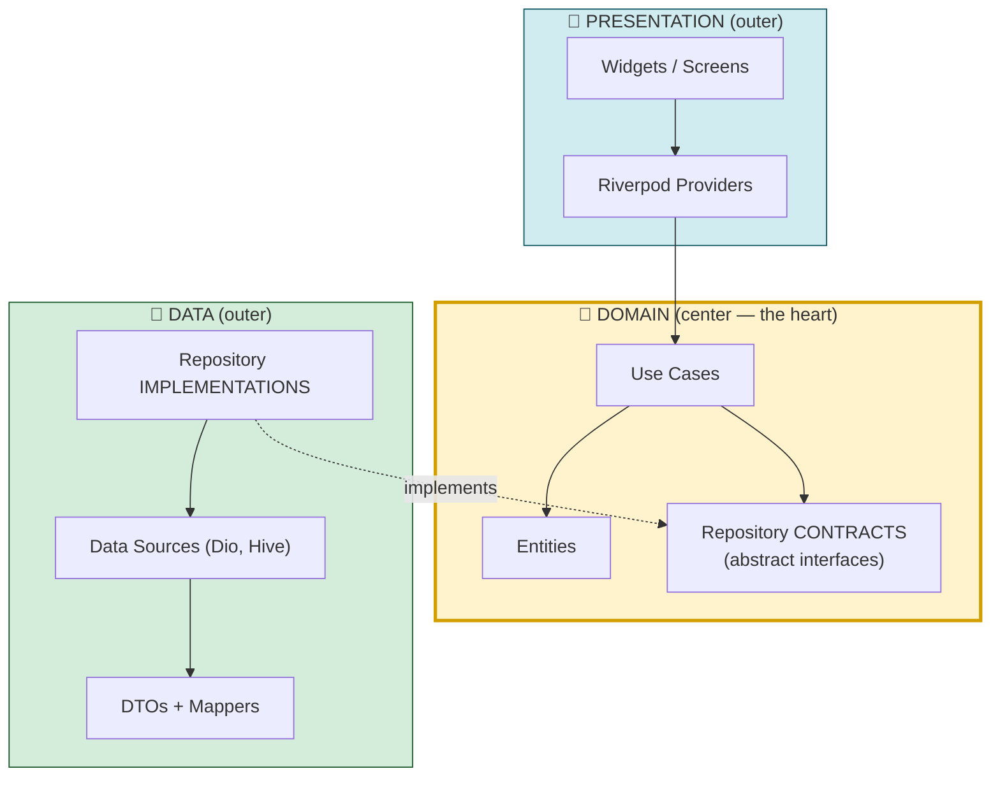
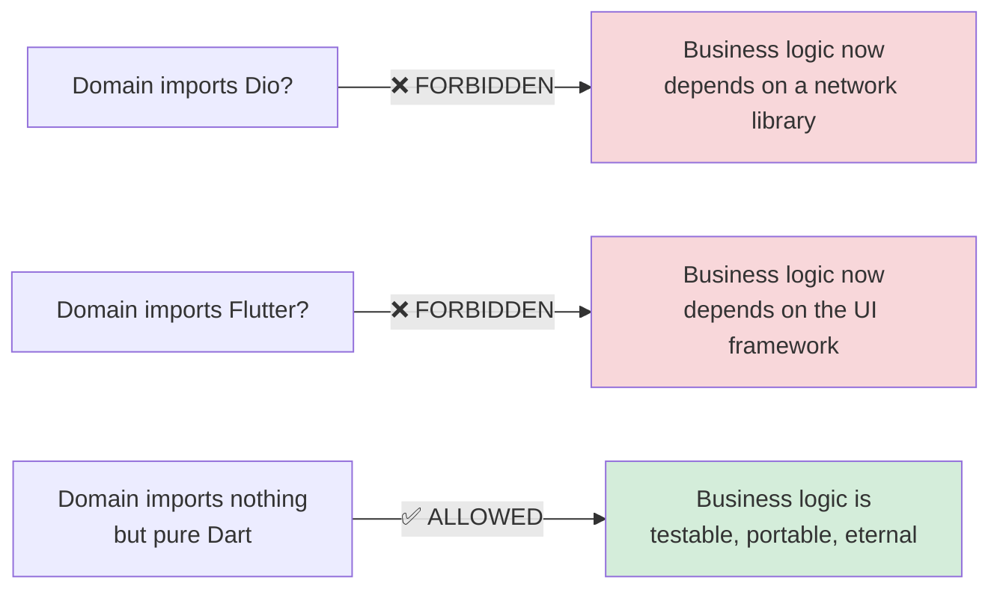
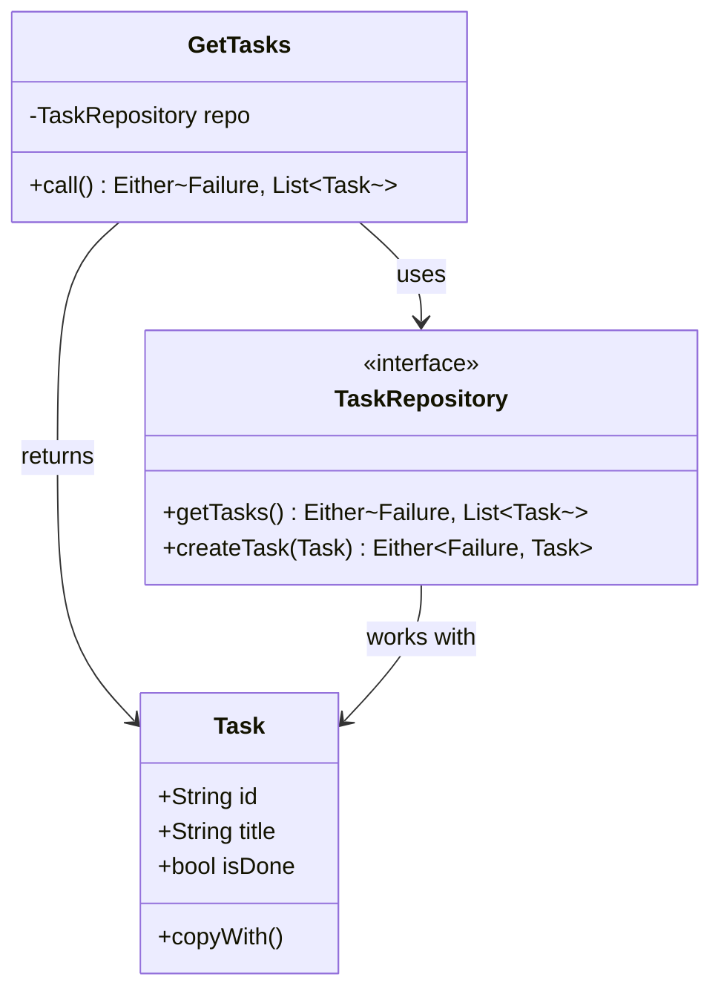
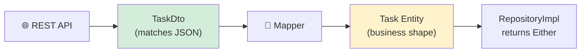
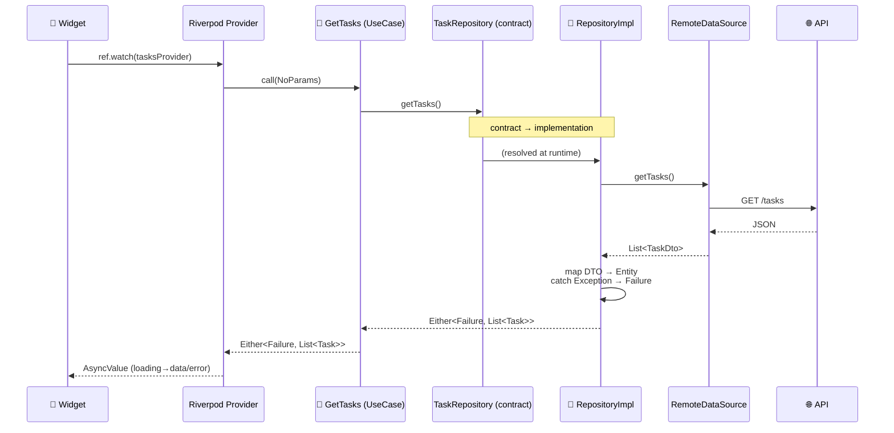
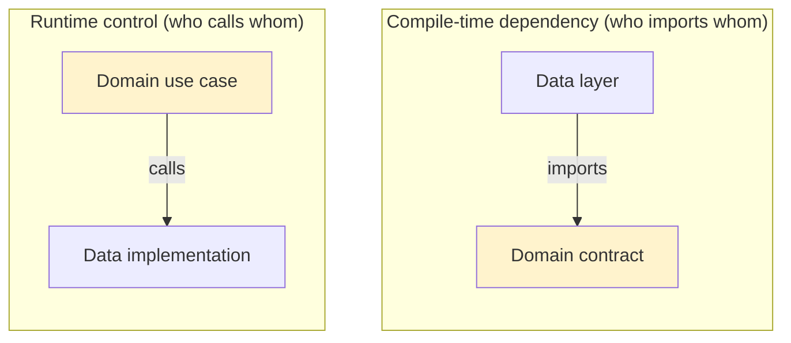
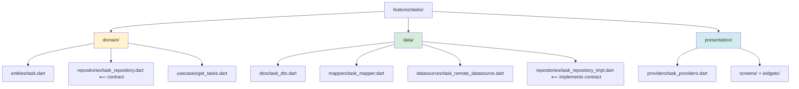
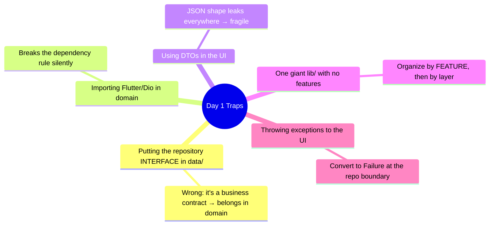

# 📖 Day 1 — Clean Architecture & the Project Skeleton
### *The chapter where you learn to build a house that never collapses*

---

## 1. The Story 🏛️

Imagine two developers, **Sara** and **Omar**, both asked to build the same app: a task manager.

**Omar** opens `main.dart` and just starts typing. He puts the API call inside the button's `onPressed`. He parses JSON right inside the widget. He stores the token in a global variable. In two days he has a working screen. Everyone claps. 👏

Then the client says: *"Change the backend from REST to GraphQL, and make it work offline."*

Omar's app **explodes**. The API code is glued to 40 different widgets. He can't test anything without a real server. Changing one thing breaks five others. He spends two weeks untangling spaghetti. 🍝

**Sara** spent her first day differently. She drew **boundaries** before writing features. She decided: *"The UI will never know what an API is. The business rules will never know what JSON is. Each part will have one job."*

When the same change request came, Sara swapped **one folder** — the data layer — and everything else kept working. She was done in an afternoon.

> **The moral:** The difference between Omar and Sara is not talent. It's that Sara built **architecture** before she built **features**. Today, you become Sara.

---

## 2. The Big Picture 🗺️

Clean Architecture organizes your app into **three concentric layers**. The most important rule in the entire chapter is about the *direction* the arrows point.

Read it like this: **Presentation and Data are both on the outside. Domain is in the middle. Everyone points *inward* toward the Domain. The Domain points at nobody.**

---

## 3. The Critical Idea: The Dependency Rule 🎯

This is the single most important sentence in Clean Architecture:

> **Source-code dependencies may only point INWARD.**

An *inner* layer (Domain) must **never** import anything from an *outer* layer (Data or Presentation).

Why does this one rule create such powerful software? Because of what it *forbids*:

**Mental model — the Onion 🧅:** The domain is the core of an onion. You can peel off the outer layers (swap Dio for `http`, swap Flutter for a CLI) and the core is untouched. But you can never have the core depend on a peel — peels come and go, the core is forever.

---

## 4. The Three Layers, One by One

### 4.1 🧠 Domain — *"The rules of the game"*

The Domain layer knows **what your app does**, not *how*. It is **pure Dart** — zero Flutter, zero Dio, zero JSON.

It contains three things:

- **Entity** (`Task`) — a business object. Not a JSON model. Just the *shape* of a task as your business cares about it.
- **Repository Contract** (`TaskRepository`) — an **abstract interface**. It's a *promise*: "someone, somewhere, will give me tasks." It does **not** say how (no Dio, no Hive mentioned).
- **Use Case** (`GetTasks`) — one single business action. It orchestrates the repository.

### 4.2 🔌 Data — *"How we actually get things"*

The Data layer is the **how**. It *implements* the promises the Domain made.

The key character here is the **Mapper** — a translator standing at the border between the API world and the business world. JSON comes in as a `TaskDto`; a clean `Task` entity comes out. The API can rename a field tomorrow and you fix it in **one** place: the mapper.

### 4.3 🎨 Presentation — *"What the user sees and touches"*

This is widgets + Riverpod. It calls **use cases** (never repositories or APIs directly) and turns the result into pixels.

---

## 5. The Full Journey of One Request 🚀

Here is what happens, end to end, when the user opens the task list. Trace it slowly — this single diagram *is* Clean Architecture in motion.

Notice the **two magic boundaries**:
1. **DTO → Entity** (the API shape never escapes the data layer).
2. **Exception → Failure** (raw errors never escape into the UI; they become safe, typed values).

---

## 6. Critical Idea: Dependency Inversion 🔄

"But wait," you ask, "if Domain can't depend on Data, how does the use case ever reach the real API?"

This is the clever trick. The **contract lives in Domain**, the **implementation lives in Data**. At runtime, we *inject* the implementation. So the arrow of *dependency* (compile-time) points the opposite way to the arrow of *control* (runtime).

> **The aha 💡:** We *inverted* the dependency. Data depends on Domain (not the reverse) because Domain owns the interface. This is the "D" in SOLID — the Dependency Inversion Principle.

---

## 7. How This Maps to TaskFlow 🧩

Your capstone folder structure *is* the architecture made physical:

Open each file in `Work and challenges/taskflow/lib/features/tasks/` and find it on this map. **You should be able to point to any file and say which layer it's in and why.**

---

## 8. Common Traps ⚠️

---

## 9. What You Must Be Able To Do By Tonight ✅

- [ ] Draw the three-layer diagram from memory and explain the arrow direction.
- [ ] Explain *why* the repository interface lives in `domain/`.
- [ ] Point at every file in `taskflow/lib/` and name its layer.
- [ ] Explain the two boundaries: DTO→Entity and Exception→Failure.
- [ ] Add the `Project` entity + `ProjectRepository` contract yourself.

---

## 10. The One Sentence To Remember 🧠

> **"Dependencies point inward; the domain is pure and depends on nothing — so the business survives any change to the framework, the network, or the UI."**

➡️ **Next chapter (Day 2):** we step into the Data layer and build the bridge to the outside world — the Dio API client.
