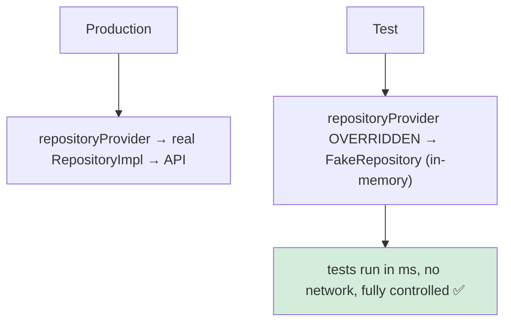
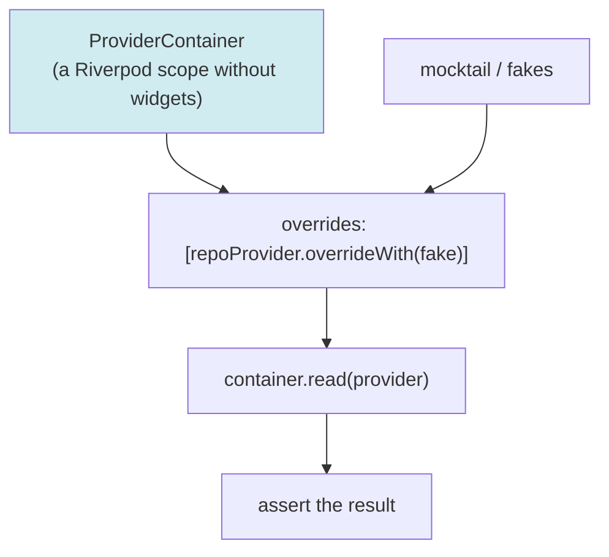
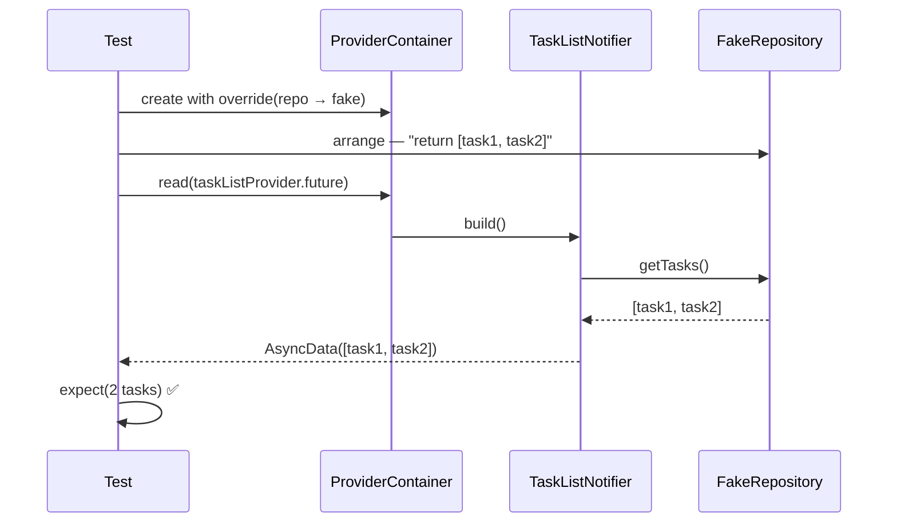
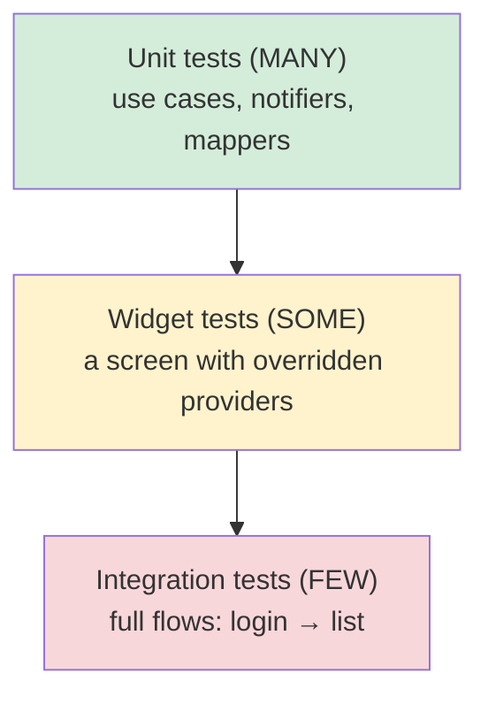
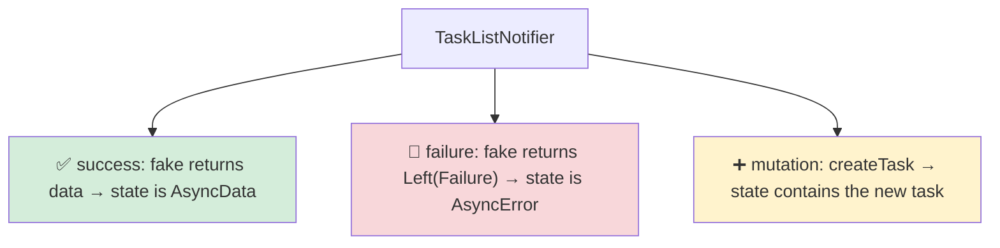
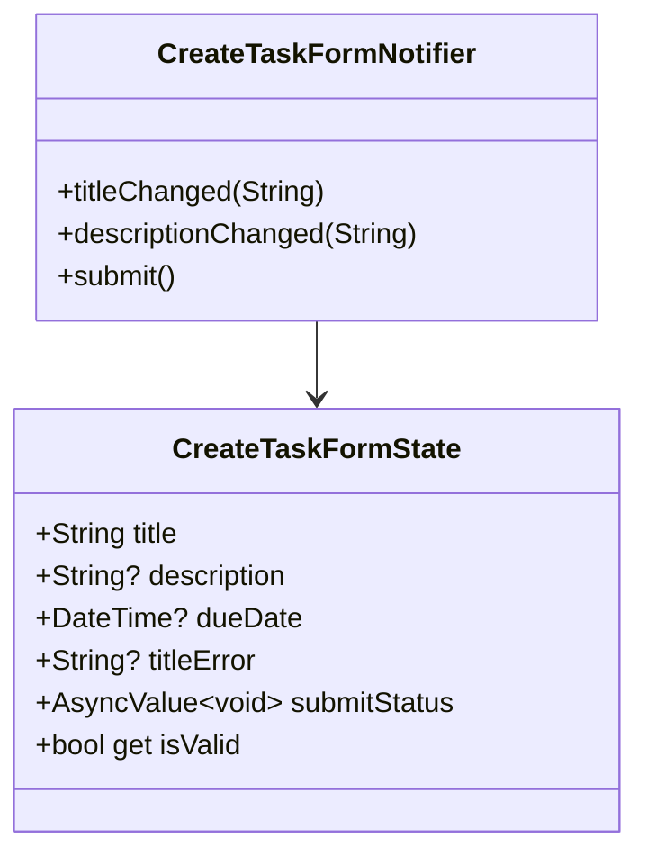
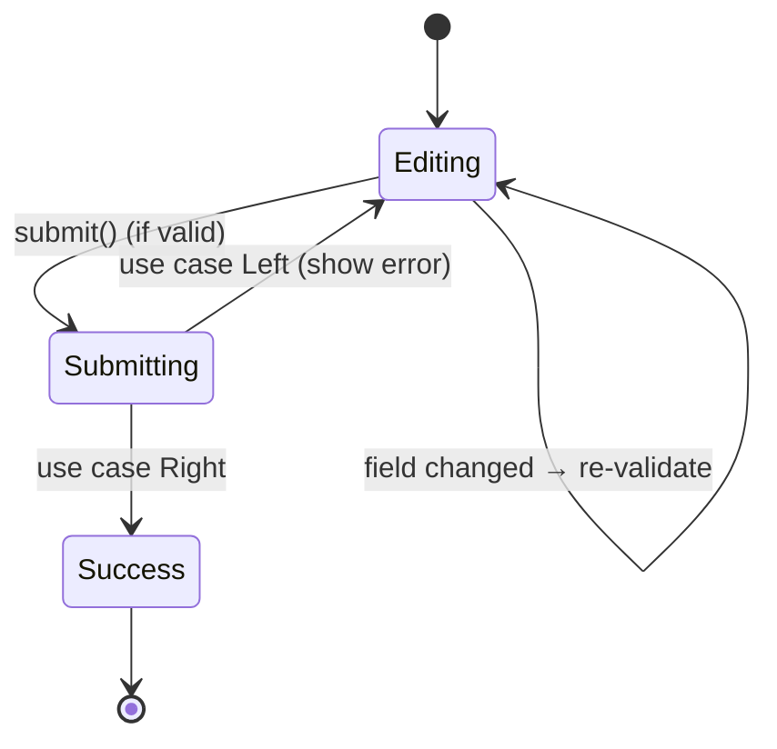
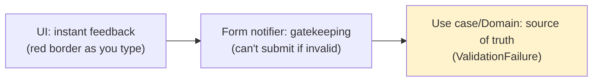
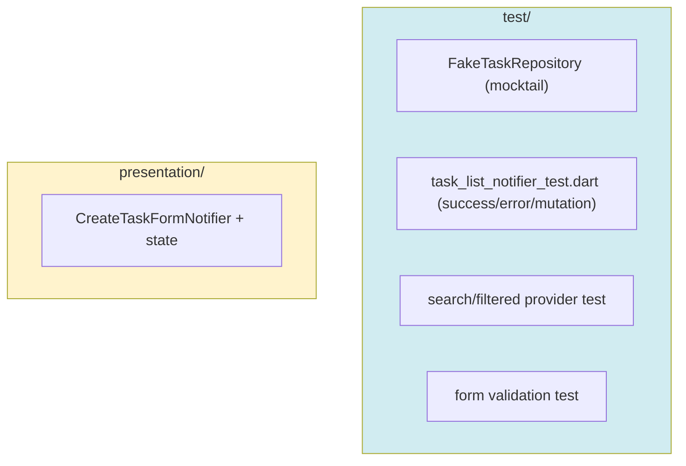
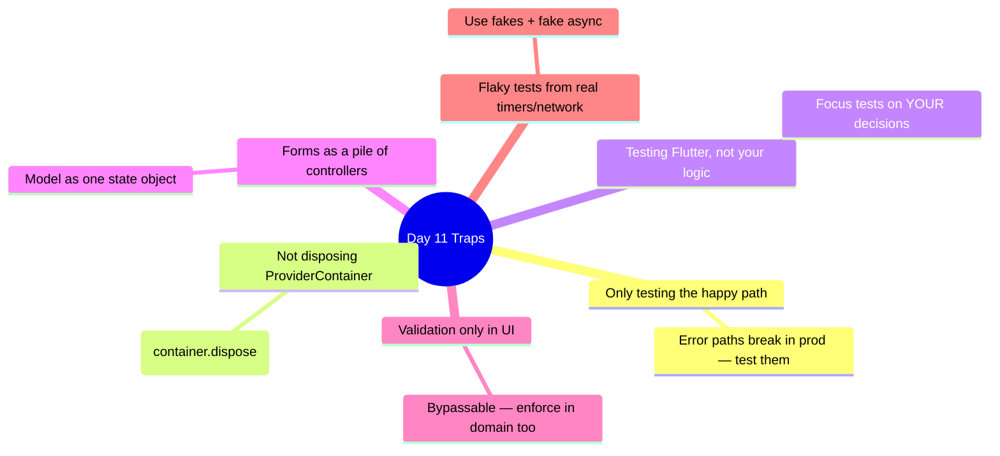

# 📖 Day 11 — Testing Riverpod & Form State ⭐
### *The chapter where you prove your code works — and tame the messiest UI of all: forms*

---

## 1. The Story 🧪

**Khaled** ships a feature. It works on his phone. Two weeks later, someone changes the repository, and the task list silently breaks in production. Nobody noticed because there were **no tests**. Every change became a game of Russian roulette.

Then there are **forms** — the create/edit task screen. Fields, validation, "is the submit button enabled?", "show the error under the email field", "disable the button while submitting". Khaled managed it with a dozen `TextEditingController`s and `setState`, and it was chaos.

Today, two superpowers: **testing** providers (so changes can't silently break things) and **form state in Riverpod** (so forms become clean, predictable state).

---

## 2. Why Riverpod Is a Joy to Test 🗺️

The same `override` mechanism that wires dependencies lets you **swap real dependencies for fakes** in tests.

> **Mental model 🎭:** Overrides are **stunt doubles**. In production the real actor (RepositoryImpl) performs. In tests, a stunt double (FakeRepository) does the dangerous scenes — you control exactly what it does (return data, throw a failure) so you can film every scene safely.

---

## 3. The Testing Toolkit 🧰

The anatomy of a provider test:

### The test pyramid (what to test, how much)

> **Critical idea 💡:** Test the *logic* heavily (cheap, fast unit tests on notifiers and use cases) and the *wiring* lightly (a few widget/integration tests). Don't test Flutter itself — test *your* decisions.

---

## 4. Testing a Notifier — The Three Cases 🎯

For `TaskListNotifier`, you assert three behaviors:

Always test the **error path** — it's the one that bites in production and the one juniors skip.

---

## 5. Form State in Riverpod 📝

A form is just **state**: the field values, their validation errors, and the submit status. Model it in a `Notifier`.

The form lifecycle as state:

> **Critical idea 💡:** Treat the form as a single state object, not a pile of controllers. The submit button's `enabled` is just `state.isValid`. The error text is just `state.titleError`. The UI becomes a pure function of form state — predictable and testable.

### Validation lives where?

Validate in the UI for *feedback*, but the domain rule (Day 7) is the real authority — the form notifier calls the use case, which can still reject.

---

## 6. How This Maps to TaskFlow 🧩

Today: write a `FakeTaskRepository`, test the notifier's three cases + the search/filter providers, then build `CreateTaskFormNotifier` with validation and a test for the empty-title case.

---

## 7. Common Traps ⚠️

---

## 8. 🏢 Interview Vault — Questions From Top Middle East Companies
> *Testing maturity is a senior gate at Instabug (a testing-adjacent company!), Careem, Foodics. Forms come up at any data-heavy app.*

**Q1. How do you unit-test a Riverpod provider/notifier?**
> **A:** Create a `ProviderContainer` with the dependency providers overridden by fakes/mocks, read the provider (or its `.future`), and assert the resulting state. Tear down the container after. This tests logic in isolation with no widgets or network.
> *🎯 Really testing:* the override + container workflow.

**Q2. What does overriding a provider in tests give you?**
> **A:** Full control of dependencies — you swap the real repository for a fake that returns exactly the data or failure you want, so you can deterministically test success, error, and edge cases. It's the core of Riverpod's testability.
> *🎯 Really testing:* dependency control for determinism.

**Q3. Explain the test pyramid and apply it to this app.**
> **A:** Many fast unit tests (use cases, notifiers, mappers), fewer widget tests (a screen with overridden providers), and a few integration tests (login→list flow). Most value comes from cheap unit tests on your logic; integration tests catch wiring issues.
> *🎯 Really testing:* pragmatic test strategy, not "100% coverage."

**Q4. How do you manage form state cleanly?**
> **A:** Model the form as a single state object (field values + validation errors + submit status) in a Notifier. The UI derives everything (button enabled = `state.isValid`, error text = `state.titleError`) from that state, so the form is a pure function of state and is testable.
> *🎯 Really testing:* state-driven UI thinking vs controller soup.

**Q5. Where should validation live — UI, state, or domain?**
> **A:** All three with different roles: UI for instant feedback, the form notifier to gate submission, and the domain/use case as the authoritative rule (returning `ValidationFailure`). UI-only validation is bypassable; the domain is the source of truth.
> *🎯 Really testing:* layered validation understanding.

---

## 9. What You Must Be Able To Do By Tonight ✅
- [ ] Explain overrides with the stunt-double analogy.
- [ ] Test a notifier's success, error, and mutation cases.
- [ ] Explain the test pyramid for this app.
- [ ] Build a form notifier with validation + test it.
- [ ] Answer interview Q1–Q5. **Checkpoint:** review Days 1–11 docs.

## 10. The One Sentence To Remember 🧠
> **"Override providers with fakes to test logic in isolation (always including the error path), and model forms as a single state object so the UI becomes a pure, testable function of that state."**

➡️ **Next chapter (Day 12):** the engine is built and tested — now we build the **UI**, consuming all these providers in real screens.
