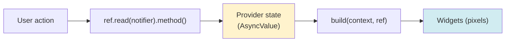
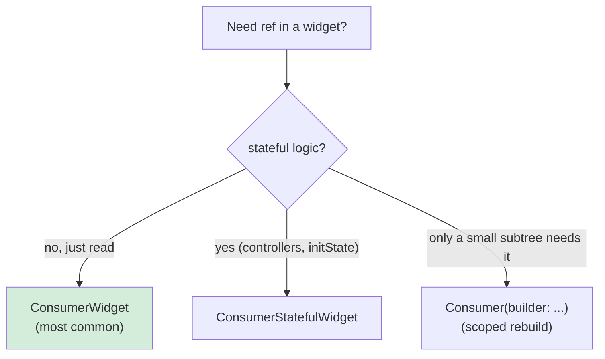
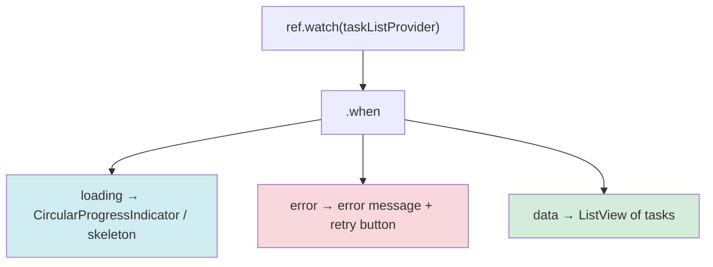
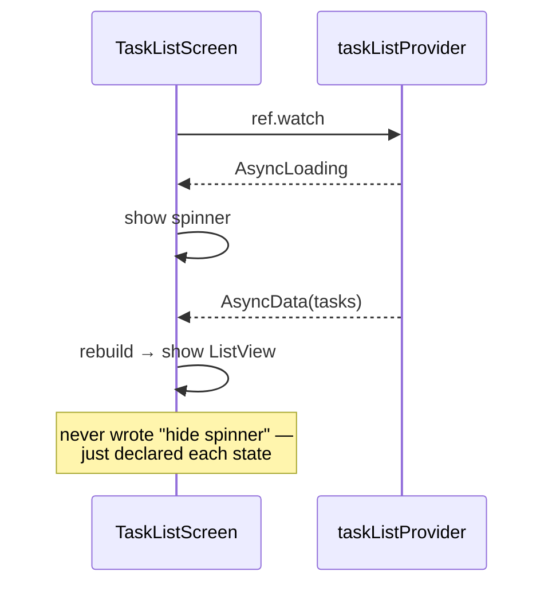
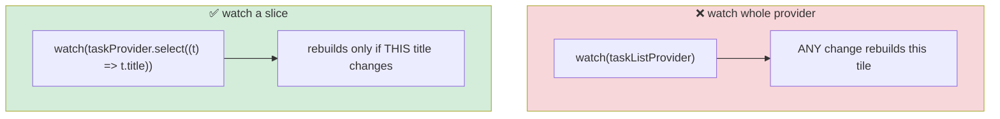
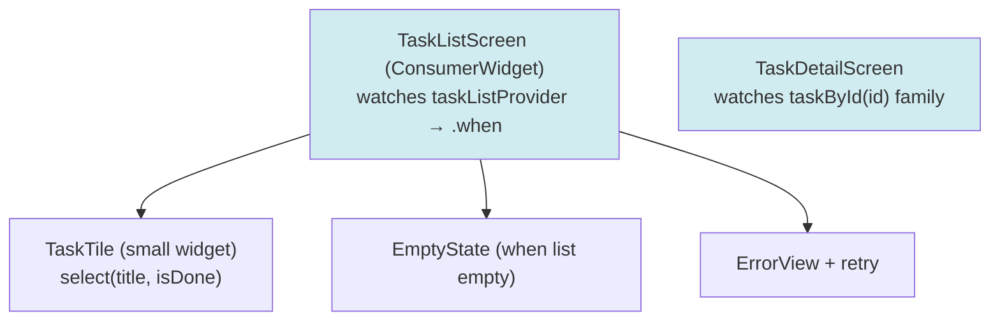
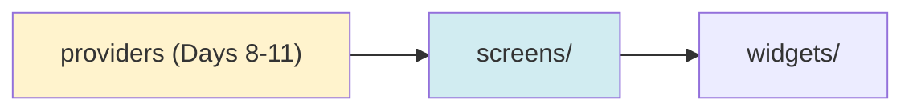

# 📖 Day 12 — Widgets, Screens & Consuming Providers
### *The chapter where all your invisible work finally becomes something you can touch*

---

## 1. The Story 🎨

For 11 days you built an engine: data layer, domain, use cases, providers, tests. But the user has *seen none of it*. Today the curtain rises. The UI is the **face** of everything underneath — and the beautiful part is that, because you built clean providers, the UI becomes almost *trivial*: it just reads a provider and draws it.

**Dina** built her UI first and her logic second — so her widgets were stuffed with API calls, parsing, and `if/else` state juggling. 600-line `build` methods. Today you do it right: widgets that are **thin** — they *watch* a provider, render its state, and forward user actions back to a notifier. The widget knows nothing about Dio or repositories. It just paints state.

---

## 2. The Big Picture: UI = f(state) 🗺️

The mental shift: in Flutter + Riverpod, your UI is a **pure function of state**. You don't *imperatively* change the UI ("hide spinner, show list"). You *declare* what each state looks like, and Riverpod re-runs `build` when state changes.



> **Mental model 🪞:** The UI is a **mirror**. It doesn't *decide* anything — it reflects the current state. Change the state and the mirror updates. To change what the user sees, you change the state, never the widget directly.

---

## 3. Consuming Providers: The Consumer Trio 🧩

To read providers in widgets, you use Consumer variants:



- **`ConsumerWidget`** — like `StatelessWidget` but `build(context, ref)`. Your default.
- **`ConsumerStatefulWidget`** — when you need `initState`/controllers (e.g. a `ScrollController`).
- **`Consumer`** — a widget you drop *inside* a tree to rebuild only that subtree.

---

## 4. Rendering `AsyncValue` with `.when` 🚦

Remember Day 9's traffic light? In the UI, `.when` turns it into three widgets:





> **Critical idea 💡:** You never manually toggle between spinner and list. You declare all three faces once, and the state decides which shows. This is *declarative* UI — the heart of Flutter.

---

## 5. The Performance Idea: `select` 🎯

`ref.watch(taskListProvider)` rebuilds the widget when *anything* in the list changes. But a single `TaskTile` only cares about *its own* task. `select` lets a widget subscribe to a **slice** of state.



> **Mental model 🔍:** `select` is a **zoom lens**. Instead of watching the whole landscape (and reacting to every leaf moving), you zoom into one flower and only react when *that* changes. Fewer rebuilds = smoother app.

---

## 6. Composing a Screen 🏗️

Break screens into small widgets — each watches the minimum it needs:



---

## 7. How This Maps to TaskFlow 🧩

Today you build three real screens, all driven by Riverpod:
- `TaskListScreen` — `.when` for loading/error/data + empty state.
- `TaskTile` — extracted widget using `select` to limit rebuilds.
- `TaskDetailScreen` — reads the `taskById(id)` family provider from Day 8.
- `ProjectListScreen`.



---

## 8. Common Traps ⚠️

```mermaid
mindmap
  root((Day 12 Traps))
    API calls / logic in build()
      build must be pure — logic goes in notifiers
    Forgetting the error/empty states
      Handle loading, error, data, AND empty
    Watching whole provider in tiny widgets
      Use select to limit rebuilds
    ref.read in build to "avoid rebuilds"
      Wrong — you WANT rebuilds in build; use watch
    600-line build methods
      Extract small widgets
    Heavy work in build
      Precompute in providers, keep build cheap
```

---

## 9. 🏢 Interview Vault — Questions From Top Middle East Companies
> *UI + Riverpod consumption is asked everywhere; the rebuild/`select` question separates seniors at Careem, Noon, Talabat.*

**Q1. `ConsumerWidget` vs `Consumer` vs `ConsumerStatefulWidget`?**
> **A:** `ConsumerWidget` is the stateless default with `build(context, ref)`. `ConsumerStatefulWidget` adds lifecycle/controllers (e.g. `ScrollController`). `Consumer` is a builder you place inside a tree to rebuild only a subtree, useful for scoping rebuilds in a mostly-static screen.
> *🎯 Really testing:* picking the right consumer + rebuild scoping.

**Q2. How do you render loading/error/data states?**
> **A:** Watch the provider's `AsyncValue` and use `.when(loading:, error:, data:)` — declaring each state's widget. Riverpod rebuilds when state changes, so you never imperatively toggle widgets.
> *🎯 Really testing:* declarative UI understanding.

**Q3. What does `select` do and why does it matter?**
> **A:** It subscribes a widget to a *slice* of a provider's state, so the widget rebuilds only when that slice changes — not on every change to the whole object/list. It's a key optimization for large lists and complex state.
> *🎯 Really testing:* rebuild optimization — a senior differentiator.

**Q4. Should `build` ever contain side effects or async calls?**
> **A:** No. `build` must be pure and may run many times. Data loading belongs in providers/notifiers; side effects (navigation, snackbars) go in `ref.listen`. Putting calls in `build` causes repeated requests and bugs.
> *🎯 Really testing:* build purity (recurring theme).

**Q5. How do you keep a large list performant?**
> **A:** Use `ListView.builder` (lazy), extract small `const` tile widgets, use `select` so tiles rebuild independently, cache images, and keep `build` cheap (precompute in providers). Avoid rebuilding the whole list on a single item change.
> *🎯 Really testing:* list performance fundamentals.

---

## 10. What You Must Be Able To Do By Tonight ✅
- [ ] Explain "UI = f(state)" with the mirror analogy.
- [ ] Render an `AsyncValue` with `.when` including empty state.
- [ ] Use `select` to limit a tile's rebuilds.
- [ ] Build the 3+ TaskFlow screens driven by providers.
- [ ] Answer interview Q1–Q5 from memory.

## 11. The One Sentence To Remember 🧠
> **"The UI is a pure function of state: widgets `watch` providers and render with `.when`, use `select` to rebuild only on the slice they care about, and forward actions to notifiers — never doing logic in `build`."**

➡️ **Next chapter (Day 13):** we connect the screens — **navigation** with guards, **forms**, and user **feedback**.
