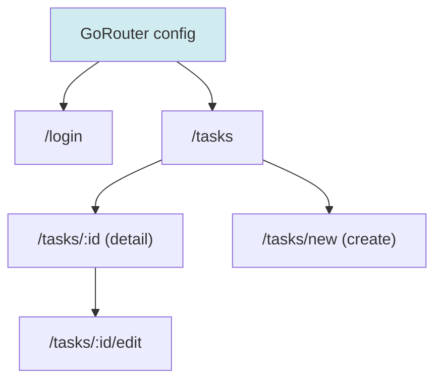
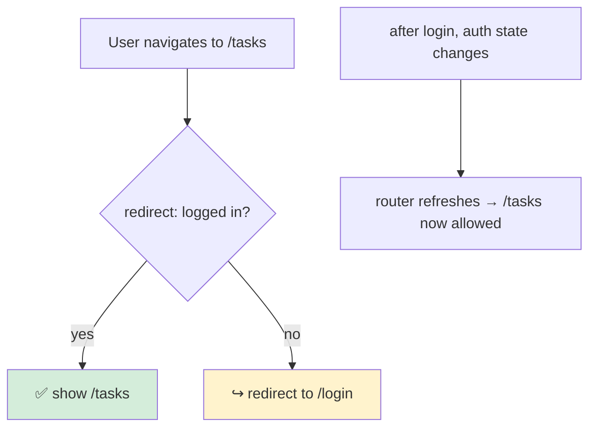
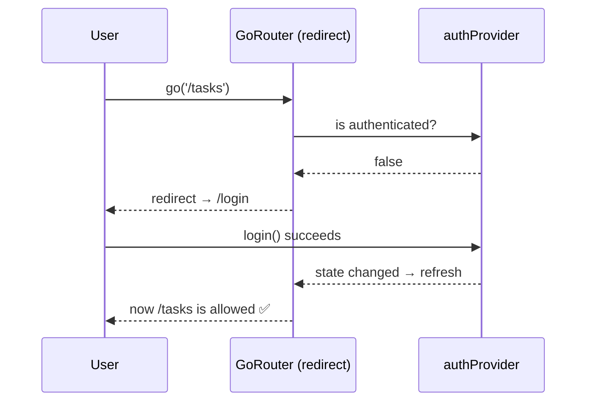
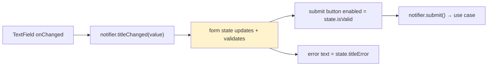
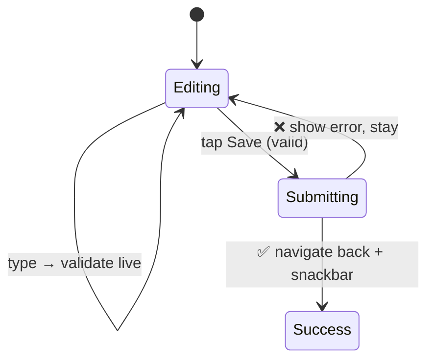
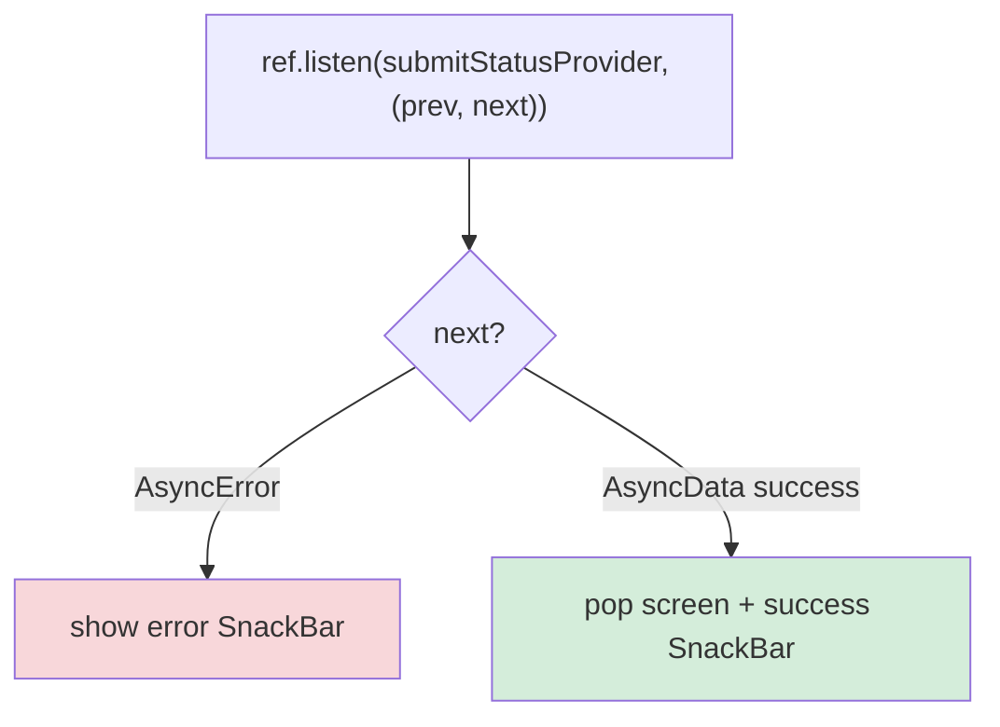
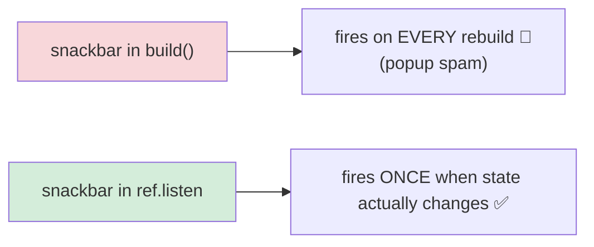
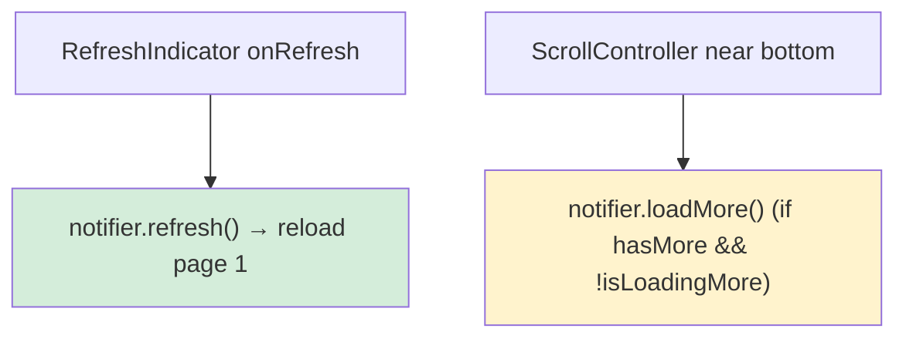
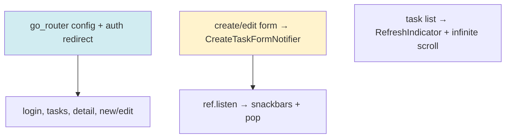

# 📖 Day 13 — Navigation, Forms & Feedback
### *The chapter where screens connect, users input data, and the app talks back*

---

## 1. The Story 🧭

A pile of screens isn't an app. An app *flows*: login → task list → tap a task → detail → edit → back. And it has *gates*: you can't see tasks if you're not logged in. And it *talks back*: "Task created ✅", "Couldn't save ❌".

**Sami** used `Navigator.push(MaterialPageRoute(...))` everywhere, scattered across widgets. Deep links didn't work. The back button did weird things. To protect a screen behind login, he checked auth inside each screen's `build` — duplicated and bypassable. His feedback (snackbars) lived inside `build`, so they fired on every rebuild, popping up repeatedly.

Today: declarative routing with **go_router**, an **auth guard** driven by a provider, **forms** wired to the form notifier from Day 11, and **feedback** done correctly with `ref.listen`.

---

## 2. The Big Picture: Declarative Routing 🗺️

`go_router` lets you declare your app's map *once* — routes, params, and redirects — instead of imperative pushes scattered everywhere.



> **Mental model 🗺️:** Old `Navigator.push` is giving *turn-by-turn directions* from every street corner. `go_router` is handing the user a *full map with named places* — they (and deep links) can jump straight to `/tasks/42` from anywhere.

---

## 3. The Critical Idea: Auth Guard via Redirect 🎯

Instead of checking login inside every screen, you put **one** redirect rule on the router that watches the auth provider.





> **Critical idea 💡:** One guard, driven by one source of truth (the auth provider), protects *every* route. No per-screen checks, nothing bypassable, and it reacts automatically when the user logs in or out.

---

## 4. Forms: Wiring UI to the Form Notifier 📝

On Day 11 you built `CreateTaskFormNotifier` (state + validation + submit). Today the UI plugs into it. The widget is *thin*: text fields push changes into the notifier; the notifier's state drives the button and error text.



The submit flow as the user experiences it:



---

## 5. Feedback Done Right: `ref.listen` 🔔

Snackbars, dialogs, and navigation-on-success are **side effects**. They must fire **once per state change**, not on every rebuild — so they live in `ref.listen`, never in `build`.





---

## 6. Pull-to-Refresh & Infinite Scroll 🔄

Connect the UI gestures to the notifiers from Days 9–10:



---

## 7. How This Maps to TaskFlow 🧩



Today: set up `go_router` with the routes, add the auth redirect reading the auth provider, build the create/edit form UI wired to the form notifier, show success/error feedback via `ref.listen`, and add pull-to-refresh + infinite scroll.

---

## 8. Common Traps ⚠️

```mermaid
mindmap
  root((Day 13 Traps))
    Scattered Navigator.push
      Use declarative go_router
    Auth check inside each screen
      One redirect guard from the auth provider
    Snackbar/dialog in build()
      Use ref.listen — fires once
    Form logic in the widget
      Lives in the form notifier
    No loading state on submit button
      Disable + spinner while submitting
    Refresh that doesn't reset pagination
      refresh() resets to page 1
```

---

## 9. 🏢 Interview Vault — Questions From Top Middle East Companies
> *Routing + auth flow is a favorite at Careem, Tabby, Noon — it touches security, UX, and architecture at once.*

**Q1. Why go_router over Navigator 1.0?**
> **A:** Declarative routing with named paths, URL/deep-link support, typed params, and centralized redirect logic (guards). Navigator 1.0's imperative `push` scatters navigation, complicates deep links, and makes guards repetitive.
> *🎯 Really testing:* knowing why declarative routing wins.

**Q2. How do you protect routes behind authentication?**
> **A:** A single `redirect` on the router that reads the auth provider: if unauthenticated and the target is protected, redirect to `/login`; refresh the router when auth state changes. One source of truth, not per-screen checks.
> *🎯 Really testing:* centralized, reactive guards.

**Q3. How do forms integrate with Riverpod?**
> **A:** The form is state in a Notifier (fields + validation + submit status). The UI pushes field changes to the notifier and derives the button's enabled state and error text from the state. Submit calls a use case and updates an `AsyncValue` submit status.
> *🎯 Really testing:* state-driven forms (links to Day 11).

**Q4. Where do snackbars/navigation-on-success go, and why?**
> **A:** In `ref.listen`, not `build`. `build` can run many times, so side effects there fire repeatedly. `ref.listen` runs the callback once per actual state change — correct for one-off effects.
> *🎯 Really testing:* the build-vs-side-effect rule again (it's that important).

**Q5. How do you implement pull-to-refresh and infinite scroll together?**
> **A:** `RefreshIndicator` calls `notifier.refresh()` which resets to page 1; a `ScrollController` (or `NotificationListener`) triggers `loadMore()` near the bottom, guarded by `hasMore`/`isLoadingMore` so it doesn't double-fire or run past the end.
> *🎯 Really testing:* combining gestures with pagination state correctly.

---

## 10. What You Must Be Able To Do By Tonight ✅
- [ ] Configure go_router with params + an auth redirect.
- [ ] Explain why the guard reads the auth provider (one source of truth).
- [ ] Wire a form UI to the form notifier.
- [ ] Show feedback via `ref.listen`, not `build`.
- [ ] Answer interview Q1–Q5 from memory.

## 11. The One Sentence To Remember 🧠
> **"Declare routes (with one auth-guard redirect from the auth provider), drive forms from a form notifier's state, and fire feedback in `ref.listen` — so navigation, input, and messages are centralized and bug-free."**

➡️ **Next chapter (Day 14):** we make it *fast and beautiful* — performance, rebuild control, skeletons, theming, and file upload.
