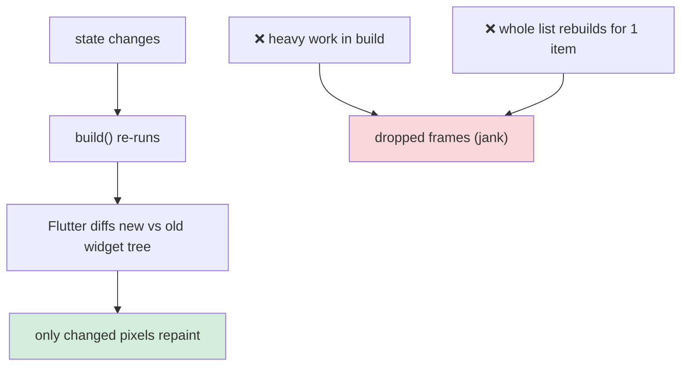
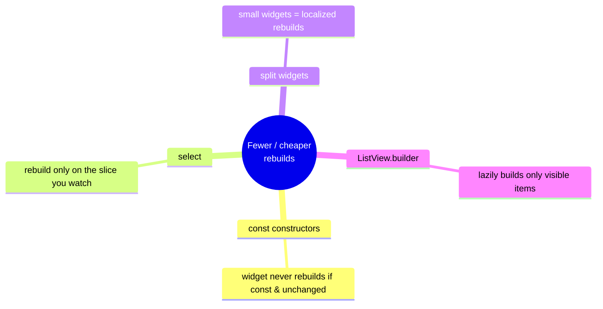
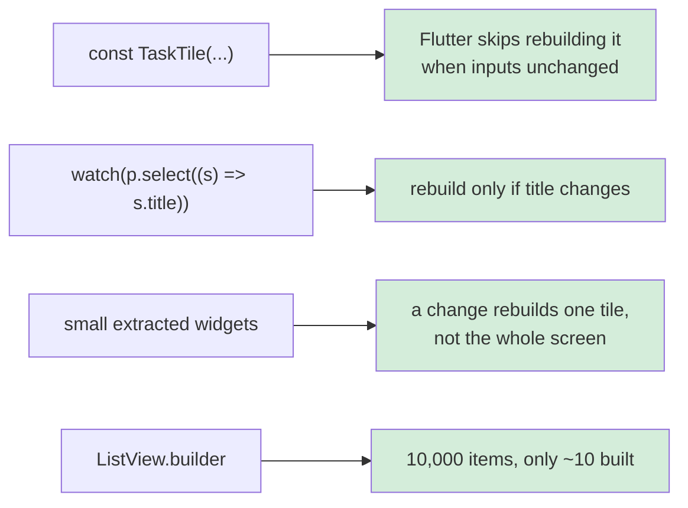
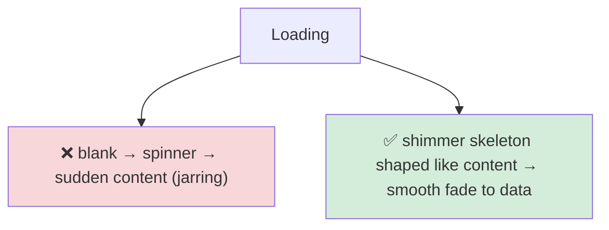
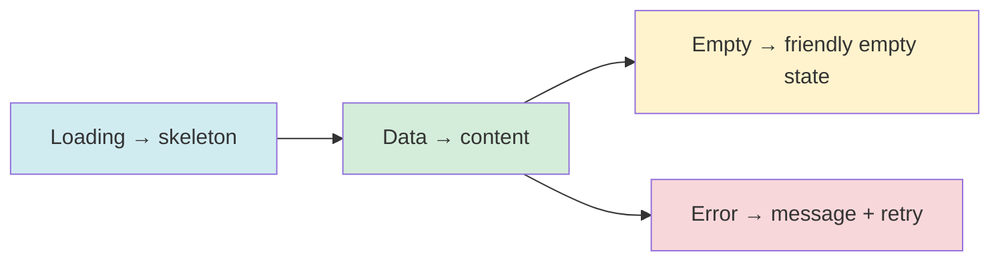
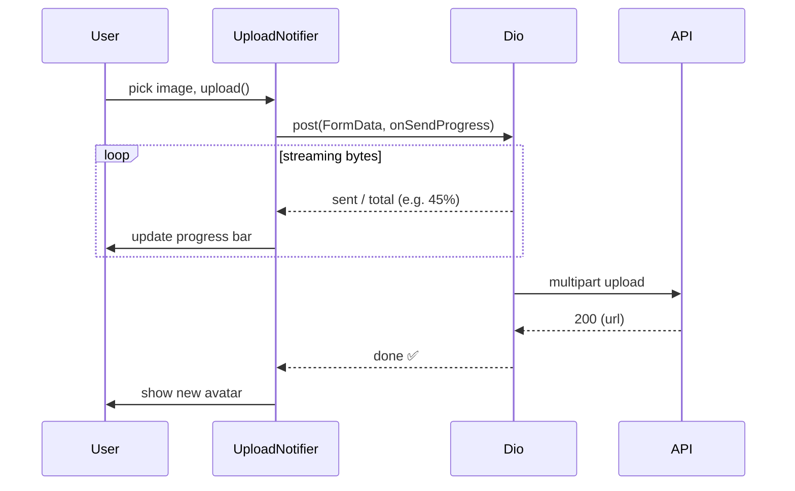
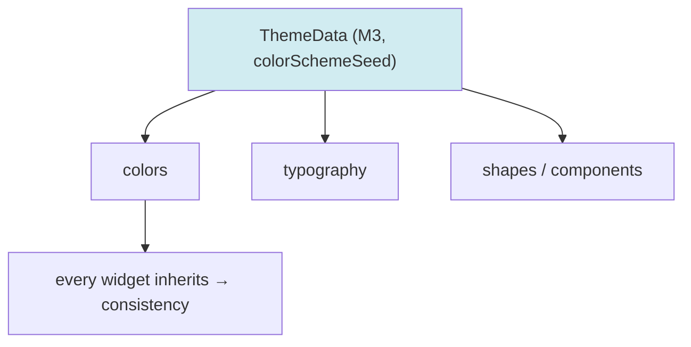
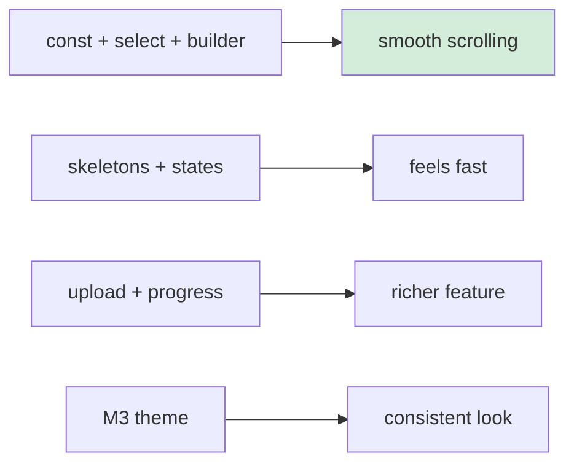
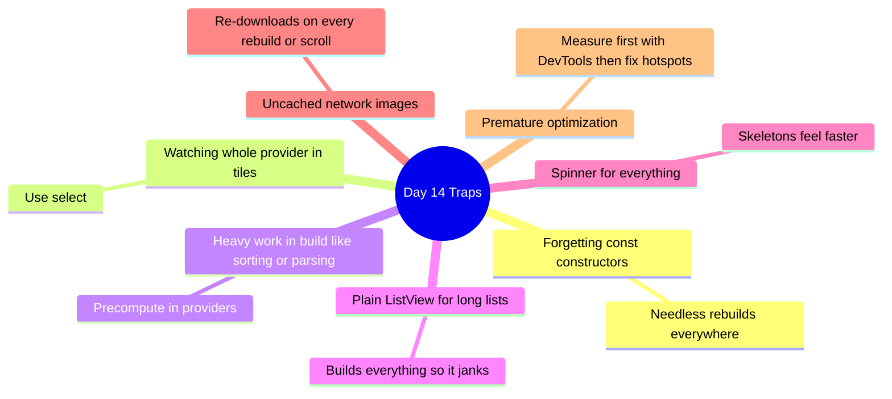

# 📖 Day 14 — UI Performance & Polish
### *The chapter where a working app becomes a delightful, fast one*

---

## 1. The Story ⚡✨

There are two task apps. Both *work*. But App A scrolls like butter, shows elegant shimmer while loading, never janks, and uploads a photo with a smooth progress bar. App B stutters when you scroll, flashes a white screen then a spinner then content, and freezes for two seconds during upload.

Same features. Wildly different feeling. The difference is **polish + performance** — the layer that separates "a student project" from "an app I'd put on my phone."

**Hassan** ignored this. His list rebuilt *every tile* whenever *one* task changed (he never used `select`). His widgets weren't `const`. He showed a bare `CircularProgressIndicator` for everything. Today you avoid Hassan's fate. (Note: if you're behind schedule, this is the **most cuttable** day — ship a smaller version and move on.)

---

## 2. The Big Picture: Why Flutter Rebuilds 🗺️

Flutter UI is `f(state)`. When state changes, Flutter re-runs `build` and *diffs* the result against the old tree. Rebuilding is normal and cheap — *unless* you rebuild **too much** or do **heavy work** inside build.

> **Mental model 🎬:** Flutter renders ~60 frames per second — one frame every **16ms**. If your `build` (or a layout) takes longer than 16ms, you *miss the frame* and the user sees a stutter. Performance work = keeping each frame under budget.

---

## 3. The Four Levers of Rebuild Performance 🎯

> **Critical idea 💡:** You don't make Flutter *faster* — you make it *do less*. `const`, `select`, small widgets, and lazy lists all reduce the *amount* of rebuilding. That's 90% of Flutter performance.

---

## 4. Perceived Performance: Skeletons & States 💀

Real performance is about milliseconds; **perceived** performance is about *feeling*. A shimmer skeleton feels faster than a spinner, even at the same load time, because it shows *structure* and progress.

Every list/screen should gracefully handle **all four** states:

---

## 5. File Upload with Progress 📤

Uploading an avatar/attachment uses a **multipart** request, and Dio gives you an `onSendProgress` callback to drive a progress bar.

> The progress is just *state* (`double progress`) in a notifier — the UI is a `LinearProgressIndicator(value: progress)`. Same pattern as everything else: UI = f(state).

---

## 6. Theming & Consistency 🎨

A polished app looks *intentional*. Centralize colors, typography, and shapes in one `ThemeData` (Material 3) so every screen is consistent and dark mode is free.

---

## 7. How This Maps to TaskFlow 🧩

Today: audit rebuilds (DevTools or `debugPrint` in build), add `const` everywhere possible, apply `select` in tiles, add shimmer skeletons + empty/error states, build the avatar/attachment upload with a progress bar, and apply a Material 3 theme.

---

## 8. Common Traps ⚠️

---

## 9. 🏢 Interview Vault — Questions From Top Middle East Companies
> *Performance is a senior gate at Careem, Noon, Talabat — their apps run on millions of low-end devices across the region.*

**Q1. How do you reduce unnecessary widget rebuilds?**
> **A:** Use `const` constructors so unchanged widgets are skipped; use `select` to watch only the slice a widget needs; split big widgets into small ones to localize rebuilds; and use `ListView.builder` for lazy construction. The goal is to make Flutter do less, not "faster."
> *🎯 Really testing:* the four levers + the "do less" mindset.

**Q2. What is the 16ms frame budget and why does it matter?**
> **A:** At 60fps, each frame has ~16ms. If build/layout/paint for a frame exceeds that, the frame is dropped and the user sees jank. Keeping `build` cheap and offloading heavy work (parsing/sorting) keeps you within budget.
> *🎯 Really testing:* you understand *why* heavy build work hurts.

**Q3. How does `const` improve performance?**
> **A:** `const` widgets are canonicalized and immutable, so Flutter can skip rebuilding/reusing them when their inputs don't change — cutting rebuild and diff work in the subtree.
> *🎯 Really testing:* concrete `const` benefit, not hand-waving.

**Q4. How do you upload a file with a progress indicator?**
> **A:** Send a multipart request via Dio `FormData`, pass an `onSendProgress` callback that reports sent/total, store that as progress state in a notifier, and bind a `LinearProgressIndicator` to it. Handle errors and cancellation.
> *🎯 Really testing:* multipart + progress as state.

**Q5. How do you diagnose a janky screen?**
> **A:** Measure with Flutter DevTools (performance/timeline, raster vs UI thread, "rebuild stats"), find the widgets rebuilding too often or the expensive build/layout, then apply targeted fixes (const, select, builder, precompute). Measure before optimizing.
> *🎯 Really testing:* a methodical, tools-first approach vs guessing.

---

## 10. What You Must Be Able To Do By Tonight ✅
- [ ] Explain the 16ms budget + the four rebuild levers.
- [ ] Apply `const` + `select` to cut rebuilds in TaskFlow.
- [ ] Add skeletons + empty/error states.
- [ ] Implement file upload with a progress bar.
- [ ] Answer interview Q1–Q5 from memory.

## 11. The One Sentence To Remember 🧠
> **"Performance is making Flutter do *less* — `const`, `select`, small widgets, and lazy lists keep every frame under 16ms — while skeletons and consistent theming make the app *feel* fast and polished."**

➡️ **Final chapter (Day 15):** we wire everything end-to-end, **test** the whole app, and graduate.
