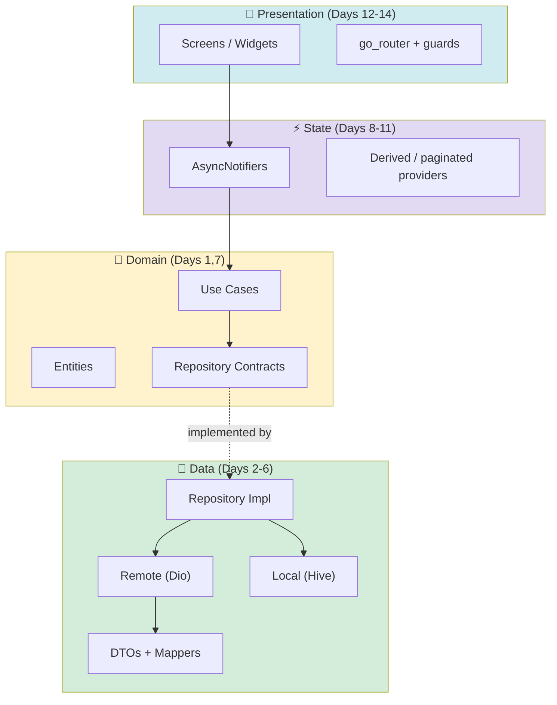
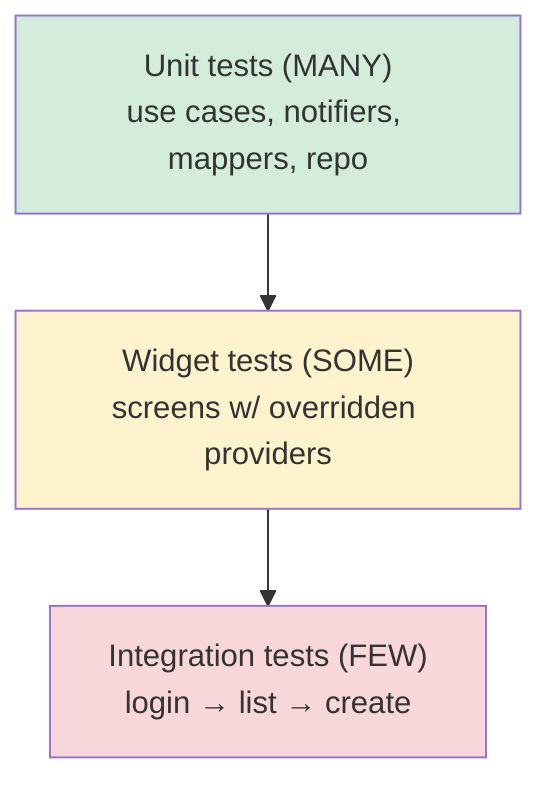
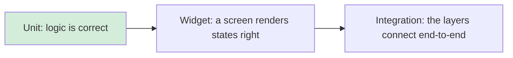
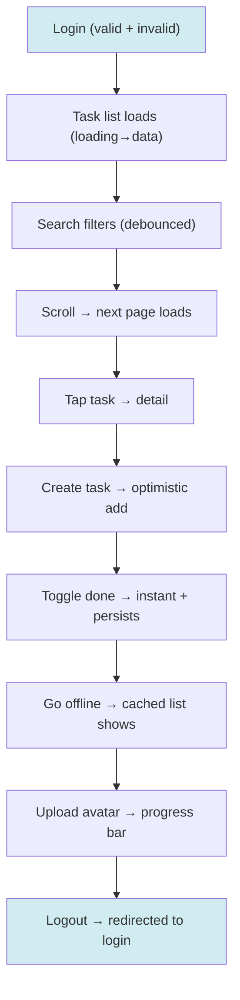
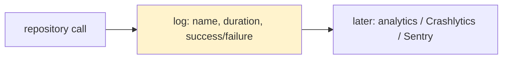
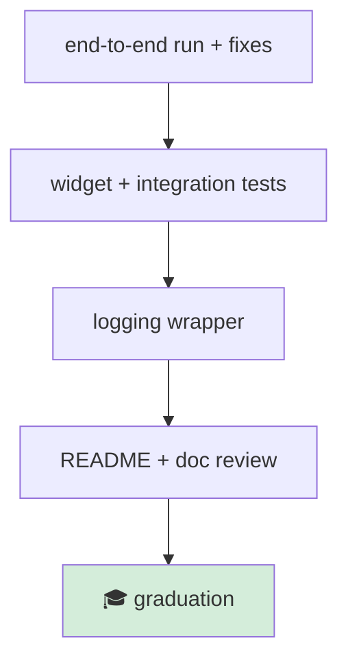
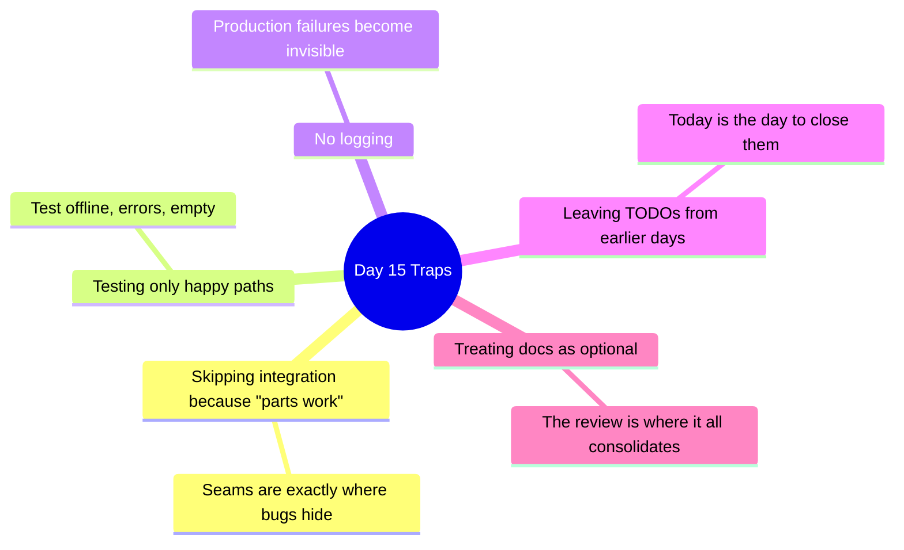
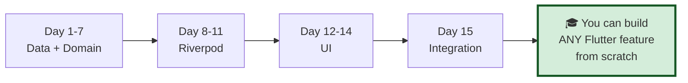

# 📖 Day 15 — Integration, Testing & Graduation 🎓
### *The chapter where the pieces become one app — and you become a Flutter architect*

---

## 1. The Story 🏁

For 14 days you built parts: a Dio client, DTOs, repositories, use cases, providers, screens. Each one worked in isolation. Today is **assembly day** — the moment all the instruments play the same song. You run the full app, end to end, find the seams where pieces don't quite fit, and tighten them. Then you write the tests that let you (and your future team) change this app *fearlessly*. Finally, you look back at 15 days of work and realize: **you can now build any Flutter feature from scratch.**

This chapter is shorter on new theory and heavier on *consolidation* — because the real learning today is seeing the whole machine run.

---

## 2. The Big Picture: The Whole Machine 🗺️

Step back and see everything you built, in one diagram:

> **Mental model 🎻:** Each day you learned one instrument. Today you're the **conductor** — making them play together. If the violins (UI) and the percussion (data) drift, you hear it immediately. Integration is where you tune the orchestra.

---

## 3. The Critical Idea: Test the Pyramid, Trust the Change 🎯

Tests aren't homework — they're **freedom**. With tests, you can refactor or add features without fear, because the tests scream the instant you break something.

What each layer's test proves:

---

## 4. The End-to-End Walkthrough ✅

Run the app and trace each flow as a real user. This is your integration checklist:

For each: does it show the right loading/error/empty/data state? Does it survive a bad network? Does the back button behave? Fix every seam you find.

---

## 5. Observability: Know What's Happening 🔭

Add lightweight logging around repository calls so that, in production, you can see what failed and where. This is the seed of real observability (analytics, crash reporting).

---

## 6. How This Maps to TaskFlow 🧩

Today: run every feature end-to-end and fix the seams; add widget tests for 2 screens (override providers); add 1 integration test for auth→list; add a logging wrapper; write the capstone **README**; and re-read all 14 prior docs, answering each day's interview questions from memory.

---

## 7. Common Traps ⚠️

---

## 8. 🏢 Interview Vault — Questions From Top Middle East Companies
> *The "tell me about a project" round at Careem, Noon, Talabat, Tabby — this is where you narrate TaskFlow and prove you're an architect, not a tutorial-follower.*

**Q1. Walk me through the architecture of an app you built.** *(THE big one)*
> **A:** Use TaskFlow: "Clean Architecture with three layers. Data has Dio + DTOs + repositories handling caching/offline/auth; Domain is pure Dart with entities and use cases and repository contracts; Presentation uses Riverpod (`AsyncNotifier`s, derived providers) and Flutter widgets. Dependencies point inward; Riverpod handles DI and makes everything testable via overrides." Then trace one request end-to-end.
> *🎯 Really testing:* can you *narrate a real system* coherently — the #1 senior signal.

**Q2. What's your testing strategy?**
> **A:** A pyramid: many unit tests on use cases/notifiers/mappers (fast, isolate logic via provider overrides), some widget tests for screens, a few integration tests for critical flows like auth→list. Test error and offline paths, not just happy paths. Tests give confidence to refactor.
> *🎯 Really testing:* pragmatic, layered strategy.

**Q3. How does your app behave offline?**
> **A:** Offline-first: the repository serves cached data when the network fails, writes go to a persisted sync queue and apply when connectivity returns, and the UI updates optimistically. The user keeps working; the app reconciles later (eventual consistency).
> *🎯 Really testing:* the resilience story end-to-end.

**Q4. If requirements changed — say, swap REST for GraphQL — what changes?**
> **A:** Only the data layer: the remote data source and DTOs/mappers. Because the domain depends on repository *contracts*, and the UI depends on use cases, neither changes. That isolation is the whole point of Clean Architecture.
> *🎯 Really testing:* proving you understand *why* the architecture pays off.

**Q5. How do you monitor and debug production issues?**
> **A:** Structured logging around key operations, crash reporting (Crashlytics/Sentry), and analytics for user flows. Typed `Failure`s map to clear messages and log entries, so a production error tells you which layer and operation failed.
> *🎯 Really testing:* production maturity beyond "it compiles."

---

## 9. 🎓 Graduation Test — Prove You're Ready
- [ ] Without notes, **draw the full architecture** and trace a request UI→API→back.
- [ ] Explain the dependency rule and *why* it matters.
- [ ] Answer one interview question from **each** of the 15 days.
- [ ] The app runs end-to-end, offline works, tests pass.
- [ ] The README + all 15 daily docs are complete.

## 10. The One Sentence To Remember 🧠
> **"A great app is the layers playing in tune: integrate end-to-end, test the pyramid so you can change fearlessly, and observe production — and if you can narrate this whole system from memory, you're no longer learning Flutter, you're architecting it."**

---

### 🎉 You did it.
You started with a folder and a target. Fifteen chapters later, you have a production-grade app, a documented mental model of every layer, and interview-ready answers for the top companies in the region. Now go build something of your own — the scaffolding is in your hands.
