# 📖 Day 2 — Networking & the API Client
### *The chapter where your app learns to talk to the outside world*

---

## 1. The Story 🌐

Your TaskFlow app is a brilliant brain in a sealed jar. It has entities, contracts, use cases — but it has never spoken to anyone. Today we give it a **mouth and ears**.

But here's the trap most beginners fall into. **Karim** writes `Dio().get('https://api.com/tasks')` directly in every data source. Then the API adds a required header. He edits 30 files. Then the token needs to be attached to every request. 30 more edits. Then the API starts returning 401 when the token expires. He has no central place to catch it. His networking is **30 separate mouths all shouting differently**.

The professional move: build **one** configured front door — an **API client** — that every request passes through. Headers, auth, logging, timeouts, retries, error translation: all handled **once**, in one place. That front door is what we build today.

---

## 2. The Big Picture: HTTP in 30 Seconds 📡

Before the client, understand the conversation it manages. Every network call is a **request → response** round trip.

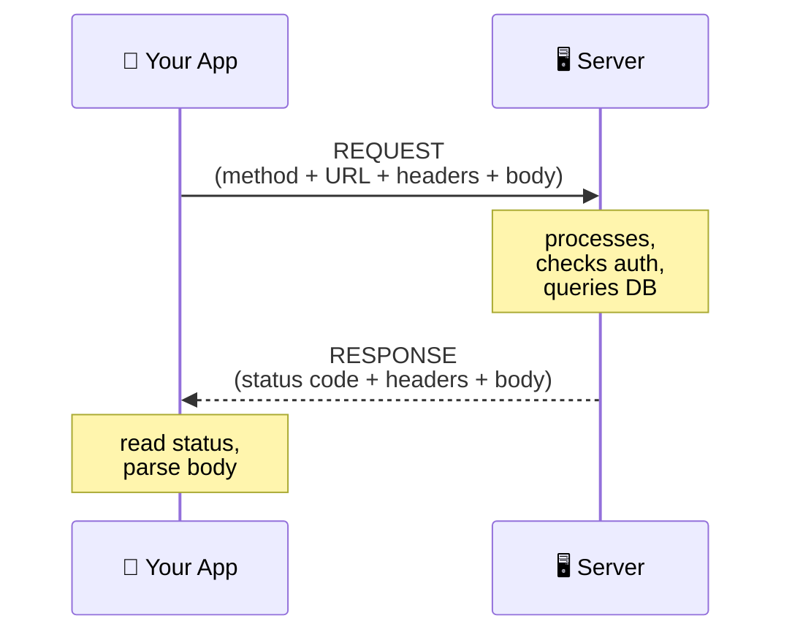

**The two things you read on every response:**

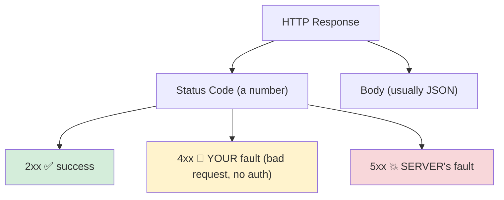

**The status-code cheat sheet you must memorize:**

| Code | Meaning | Who's to blame |
|---|---|---|
| 200 / 201 | OK / Created | nobody — celebrate |
| 400 | Bad Request | you sent garbage |
| 401 | Unauthorized | no/expired token → **refresh** |
| 403 | Forbidden | logged in, but not allowed |
| 404 | Not Found | wrong URL or deleted resource |
| 422 | Unprocessable | validation failed |
| 500 | Server Error | backend crashed |

**The REST verbs** — the "grammar" of talking to a server:

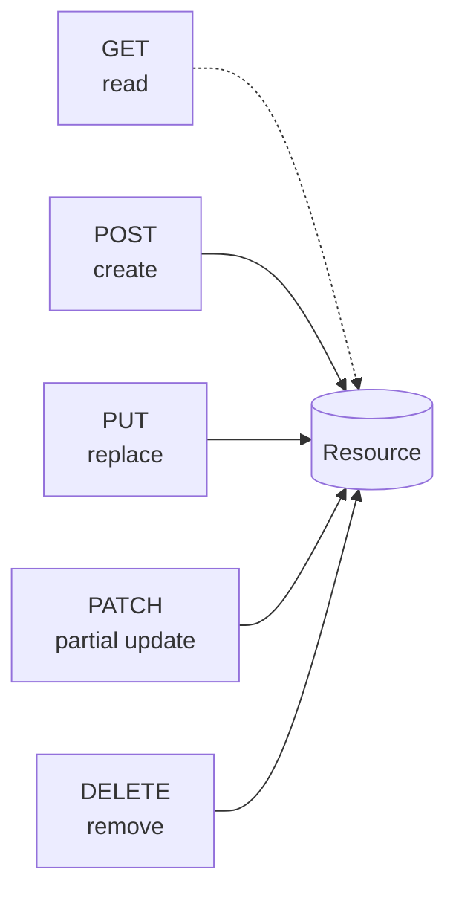

---

## 3. The Critical Idea: One Front Door 🚪

Instead of scattered `Dio()` calls, you build **one** configured `Dio` instance that the whole app shares. Every request walks through the same hallway of **interceptors**.

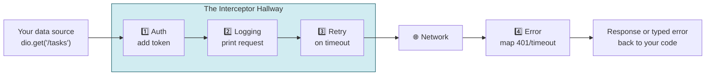

> **Mental model 🚪:** An interceptor is a *security guard standing in a hallway*. Every request that wants to leave the building, and every response that wants to come in, must walk past the guards. The guards stamp passports (add token), write in the logbook (logging), and turn away troublemakers (errors).

---

## 4. Interceptors — The Heart of Today

An interceptor has three hooks. Understanding *when* each fires is everything:

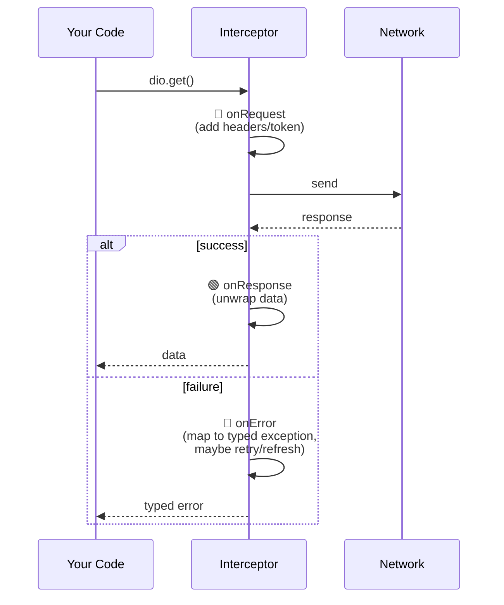

**The order of interceptors matters.** Think about it logically:

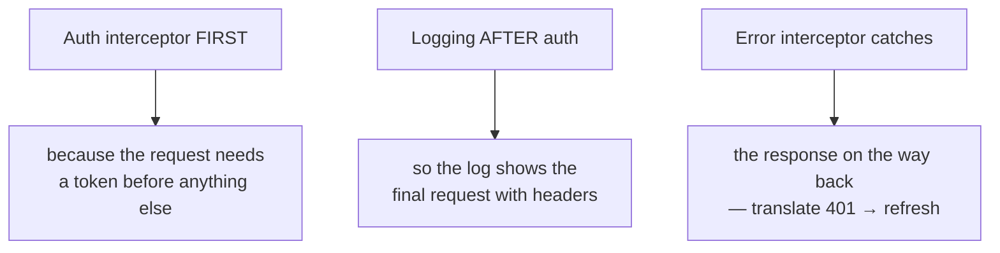

### The auth + refresh flow (the trickiest part)

When a request gets a **401**, a smart client doesn't just fail — it silently gets a fresh token and retries:

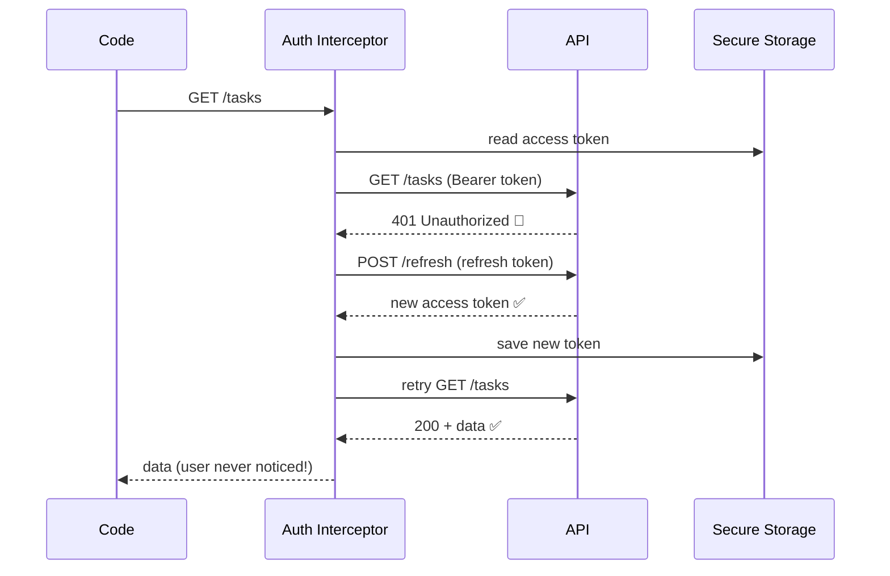

> **Critical idea 💡:** Good networking is *invisible*. The user should never see "session expired" for a recoverable problem. The refresh dance happens behind the curtain.

---

## 5. Translate Errors at the Border 🛂

Dio throws `DioException`. But remember Day 1's rule: **raw library errors must not leak inward.** So the error interceptor / data source converts them into *your* typed exceptions immediately.

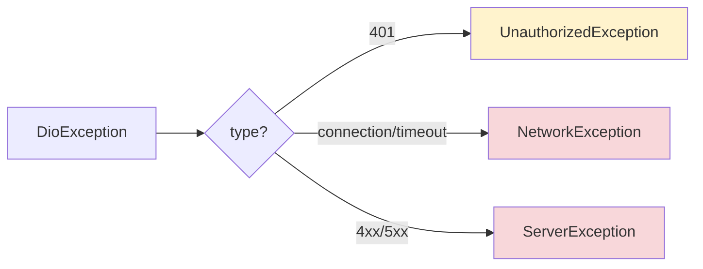

These exceptions later become `Failure`s at the repository (Day 6). The chain is: **DioException → your Exception → Failure → friendly UI message.** Each layer speaks its own language.

---

## 6. How This Maps to TaskFlow 🧩

Today you grow `lib/core/network/dio_client.dart` from a stub into a real client:

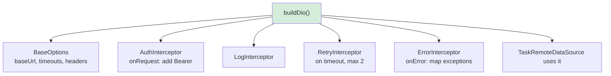

Pick a free practice API today: **reqres.in** or **jsonplaceholder.typicode.com** — point `baseUrl` at it and make a real GET succeed.

---

## 7. Common Traps ⚠️

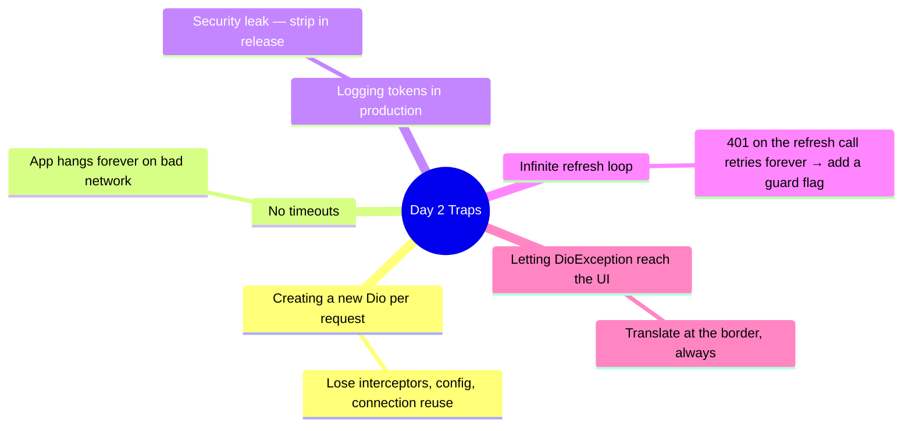

---

## 8. What You Must Be Able To Do By Tonight ✅

- [ ] Explain request/response + read any status code's meaning.
- [ ] Explain what an interceptor is and give the 4 you built.
- [ ] Draw the 401 → refresh → retry sequence from memory.
- [ ] Make a real GET call through your client and see it logged.
- [ ] Explain why a single shared Dio beats scattered `Dio()` calls.

---

## 9. 🏢 Interview Vault — Questions From Top Middle East Companies
> *Networking + auth questions are heavy at delivery/fintech companies — Careem, Talabat, Noon, Tabby, Tamara, Jahez — because their apps live or die on flaky mobile networks.*

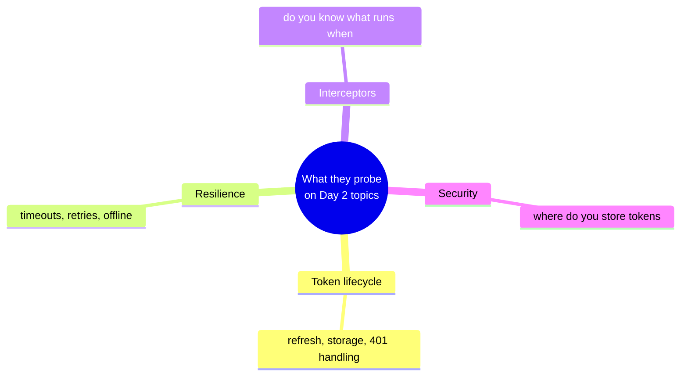

**Q1. How do you handle token refresh on a 401?**
> **A:** An auth interceptor catches the 401, calls the refresh endpoint with the refresh token, stores the new access token securely, and retries the original request — transparently to the user. I add a guard flag so a 401 on the refresh call itself doesn't cause an infinite loop, and I queue concurrent requests during refresh so they all retry once with the new token.
> *🎯 Really testing:* the **infinite-loop guard** and **concurrent-request queueing** — that's the senior-level detail juniors miss.

**Q2. Where do you store the access and refresh tokens, and why not SharedPreferences?**
> **A:** In `flutter_secure_storage` (Keychain on iOS, Keystore/EncryptedSharedPreferences on Android). SharedPreferences is plain text and readable on rooted/jailbroken devices, so storing tokens there is a security risk.
> *🎯 Really testing:* security awareness.

**Q3. What's the difference between `connectTimeout`, `sendTimeout`, and `receiveTimeout`?**
> **A:** `connectTimeout` = time to establish the TCP/TLS connection; `sendTimeout` = time to upload the request body; `receiveTimeout` = time to download the response. Setting all three prevents the app from hanging indefinitely on a bad network.
> *🎯 Really testing:* practical Dio depth.

**Q4. Why use interceptors instead of handling headers/errors in each call?**
> **A:** DRY and a single source of truth. Auth, logging, retry, and error translation are cross-cutting concerns — putting them in one interceptor chain means one place to change, consistent behavior everywhere, and data sources that stay clean.
> *🎯 Really testing:* cross-cutting-concern thinking.

**Q5. A request fails. How do you decide whether to retry?**
> **A:** Retry only *idempotent, transient* failures — timeouts and 5xx on GETs — with capped attempts and backoff. Never blindly retry a POST (could double-create) or a 4xx (your request is wrong; retrying won't help).
> *🎯 Really testing:* understanding idempotency and not retrying the wrong things.

**Q6. How would you make networking testable?**
> **A:** Depend on an abstraction (the data source interface), inject the Dio instance, and in tests use a mock Dio or `http_mock_adapter` so no real network is hit. The repository can then be tested against fake responses including error cases.
> *🎯 Really testing:* testability of the network layer.

---

## 10. The One Sentence To Remember 🧠

> **"All traffic flows through one configured client, where interceptors add the token, log the call, retry on failure, and translate every raw error into a typed one — so the rest of the app never touches networking details."**

➡️ **Next chapter (Day 3):** the data arrives as messy JSON. We build **DTOs and mappers** to turn it into clean, type-safe business entities.
