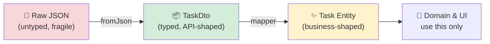
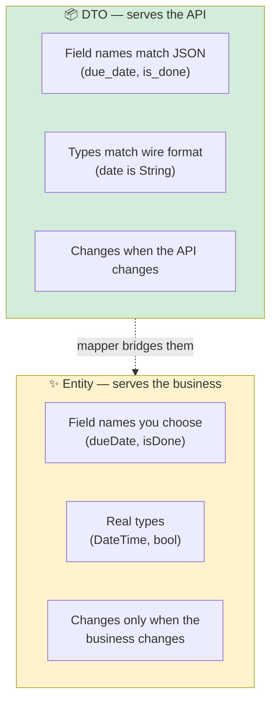
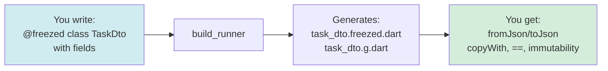
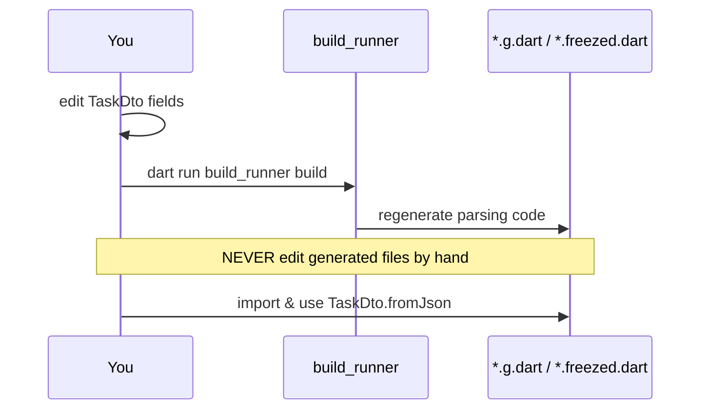
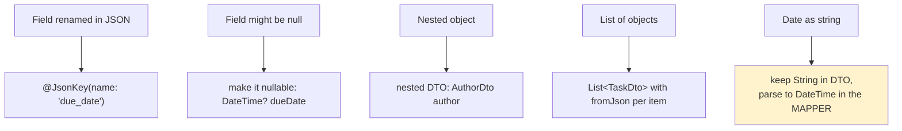
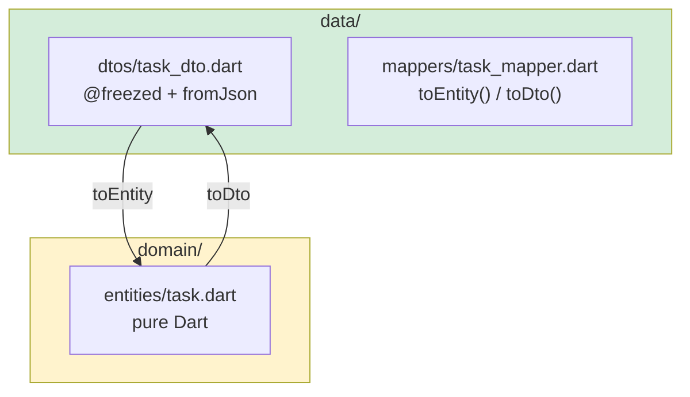
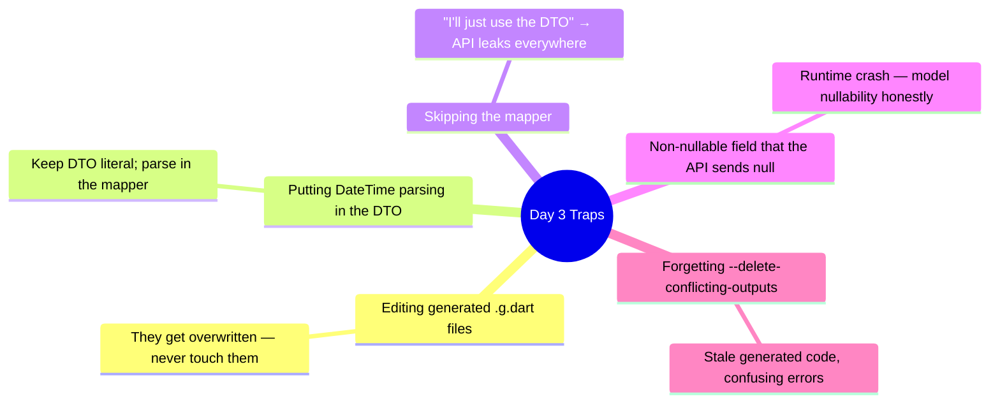

# 📖 Day 3 — DTOs, Serialization & Mapping
### *The chapter where messy JSON becomes clean, type-safe truth*

---

## 1. The Story 🧾

The API hands your app a **crumpled receipt** — a blob of JSON: `{"due_date": null, "is_done": "1", "titel": "Buy milk"}`. Notice the problems: a typo (`titel`), a date that's a string, a boolean that's actually a string `"1"`, a null where you didn't expect one.

**Layla** uses `response.data['titel']` directly in her widget. It works… until the backend fixes the typo to `title`. Now her app shows blank titles in production, and she has 60 places to fix. Each `['...']` is a landmine — no autocomplete, no type checking, crashes only at runtime.

The professional approach: the instant JSON arrives, **stamp it into a strict, typed object** (a DTO). If the JSON shape is wrong, you find out at the *border*, in one place — not scattered across 60 widgets. Then you **translate** that DTO into a clean business `Entity`. Today you build that customs checkpoint.

---

## 2. The Big Picture 🗺️



Two transformations, two purposes:
- **`fromJson`** — *parsing*: untyped → typed. Catches shape errors.
- **mapper** — *translating*: API language → business language. Decouples you from the API.

---

## 3. The Critical Idea: DTO ≠ Entity 🎯

Beginners ask: *"Why two classes that look almost the same? Isn't that duplication?"* No — they answer to **two different masters**:



> **Mental model 🛂:** The DTO is a *passport from the API's country*. The Entity is your *citizen ID*. At the border (the mapper), a traveler trades one for the other. You never let foreign passports roam freely inside your country.

---

## 4. Serialization & Code Generation ⚙️

Writing `fromJson`/`toJson` by hand is tedious and error-prone. **`freezed` + `json_serializable`** generate them for you — plus immutability, `copyWith`, `==`, and `toString`.



The command that runs the machine:
```bash
dart run build_runner build --delete-conflicting-outputs
# or, while developing, auto-regenerate on save:
dart run build_runner watch --delete-conflicting-outputs
```



---

## 5. Handling Real-World JSON Mess 🌍

APIs are messy. Your DTO is where you tame it:



> **Critical idea 💡:** Keep the DTO *dumb and literal* — it mirrors JSON exactly, strings and all. Do the *smart* conversions (String → DateTime, `"1"` → `true`) in the **mapper**. This keeps parsing separate from interpretation.

---

## 6. How This Maps to TaskFlow 🧩



Today you convert the plain `task_dto.dart` (from Day 1) into a `freezed` model, run `build_runner`, and confirm `task_mapper.dart` still produces a clean `Task`.

---

## 7. Common Traps ⚠️



---

## 8. 🏢 Interview Vault — Questions From Top Middle East Companies
> *Foodics, Instabug, Noon, Vezeeta lean on this — clean data modeling separates juniors from mid/seniors.*

**Q1. Why separate DTOs from domain entities?**
> **A:** DTOs are API-shaped and change when the backend changes; entities are business-shaped and stable. The mapper isolates API churn to one file. Without the split, a renamed JSON field breaks the whole app.
> *🎯 Really testing:* coupling/decoupling judgment.

**Q2. What does `freezed` give you over a hand-written class?**
> **A:** Immutability, `copyWith`, value equality (`==`/`hashCode`), `toString`, union/sealed types, and (with `json_serializable`) `fromJson`/`toJson` — all generated, so no boilerplate bugs.
> *🎯 Really testing:* you know *why* the tool exists, not just how to annotate.

**Q3. The API returns a date as a string. Where do you convert it to `DateTime`?**
> **A:** In the mapper, not the DTO. The DTO stays a literal mirror of the JSON (`String dueDate`); the mapper interprets it into a `DateTime` for the entity. This separates parsing from interpretation.
> *🎯 Really testing:* clean separation of concerns at a fine grain.

**Q4. How do you handle a field that's sometimes missing or null?**
> **A:** Model it as nullable in the DTO and provide a sensible default in the mapper (or keep it nullable in the entity if the business allows). Never assume presence — defensive parsing prevents production crashes.
> *🎯 Really testing:* defensive, production-minded coding.

**Q5. How do you handle API versioning / breaking changes?**
> **A:** Because all parsing is funneled through DTOs + mappers, a breaking change is absorbed in those two files (and possibly a new versioned DTO). The domain and UI don't change. You can even map two DTO versions to the same entity during a migration.
> *🎯 Really testing:* maintainability at scale.

---

## 9. What You Must Be Able To Do By Tonight ✅
- [ ] Explain DTO vs Entity with the passport analogy.
- [ ] Convert `TaskDto` to `freezed` and run `build_runner` cleanly.
- [ ] Handle a renamed + a nullable field correctly.
- [ ] Explain why date parsing belongs in the mapper.
- [ ] Answer interview Q1–Q5 from memory.

## 10. The One Sentence To Remember 🧠
> **"Parse JSON into a literal DTO at the border, then map it into a clean business entity — so API mess is caught early and never leaks inward."**

➡️ **Next chapter (Day 4):** we build the **Repository** and coordinate remote + local data sources into a single source of truth.
