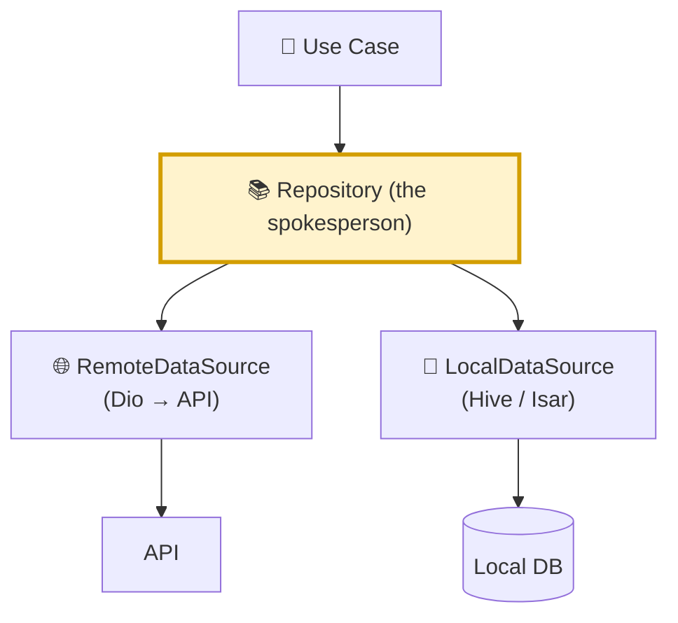
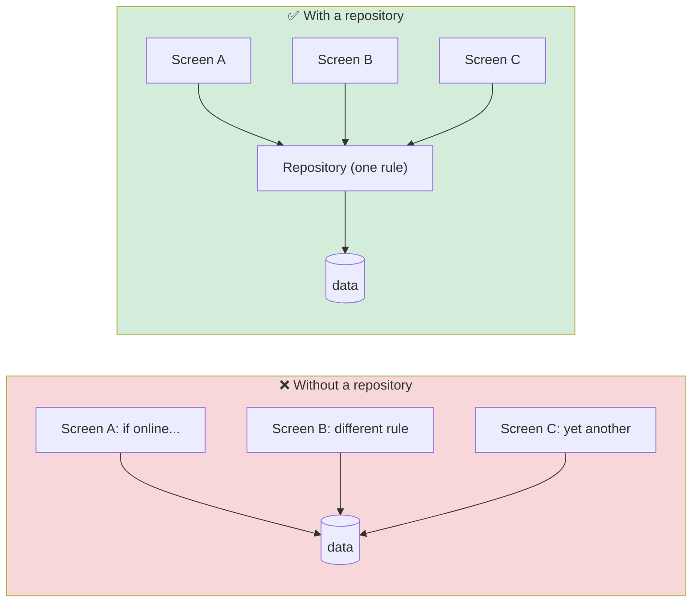
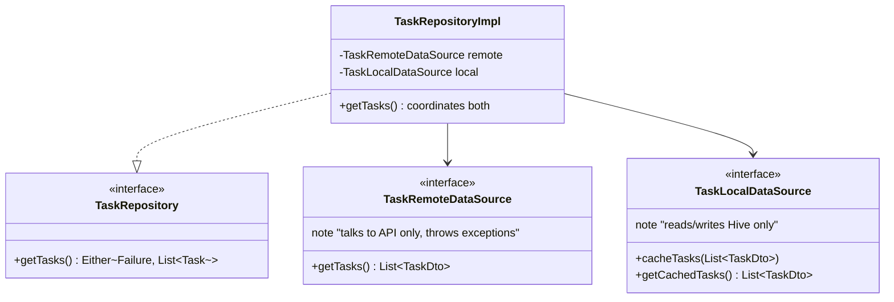
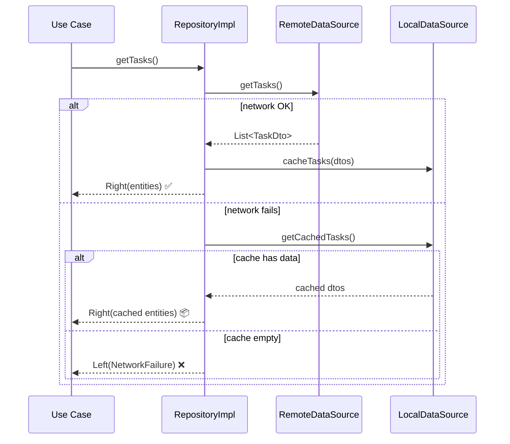
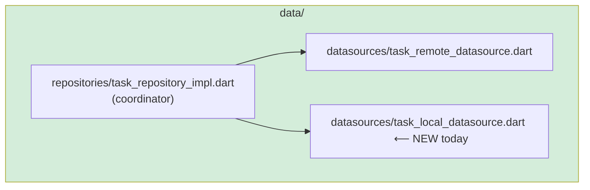
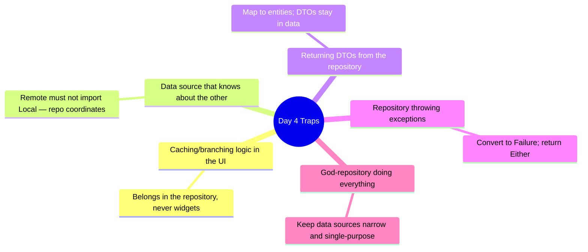

# 📖 Day 4 — Repository & Data Sources
### *The chapter where scattered data becomes one trustworthy voice*

---

## 1. The Story 🗂️

Your app now has two places to get a task from: the **network** (fresh, but needs internet) and the **local database** (instant, but maybe stale). 

**Yousef** lets his widgets decide: *"If online, call the API; else read Hive."* That logic — `if (online) ... else ...` — ends up copy-pasted into every screen. When the caching rule changes, he hunts through the whole UI. Worse, two screens implement the rule slightly differently and show **different data for the same task**. The app contradicts itself.

The fix is the **Repository**: a single trusted spokesperson. The UI asks the repository *"give me the tasks"* and never knows or cares whether the answer came from the network, the cache, or a carrier pigeon. The repository alone decides. One rule, one place, one truth. That's what you build today.

---

## 2. The Big Picture 🗺️

> **Mental model 📚:** The repository is a **librarian**. You ask for a book; you don't care whether she fetches it from the shelf (cache), orders it from another branch (network), or photocopies it. You just trust her to hand you the right book. The *coordination* is her job, hidden from you.

---

## 3. The Critical Idea: Single Source of Truth 🎯

The phrase you'll repeat in interviews: the repository is the **single source of truth (SSoT)**. Every consumer goes through it, so the rule lives in exactly one place.

---

## 4. Remote vs Local — Who Does What 🔌💾

The repository delegates. Each data source has **one narrow job** and knows nothing about the other:

- **RemoteDataSource:** makes the Dio call, returns DTOs, throws exceptions. Nothing else.
- **LocalDataSource:** reads/writes the local DB. Nothing else.
- **RepositoryImpl:** the brain — decides *when* to use each, maps DTO→Entity, and converts Exception→Failure.

---

## 5. The Read-Through Flow 🔄

Here's the classic "network, then cache, with offline fallback" dance the repository orchestrates:

> **Critical idea 💡:** The repository turns *failure into graceful degradation*. A dropped connection doesn't mean a blank screen — it means "show what we last knew." This is the seed of offline-first (Day 5).

---

## 6. How This Maps to TaskFlow 🧩

Today you: create `TaskLocalDataSource` (Hive), init Hive in `main.dart`, implement the read-through + offline-fallback in `TaskRepositoryImpl`, and finish the `toggleDone`/`deleteTask` methods left as TODOs on Day 1.

---

## 7. Common Traps ⚠️

---

## 8. 🏢 Interview Vault — Questions From Top Middle East Companies
> *Careem, Talabat, Noon ask this constantly — their apps must work on patchy 3G across the region.*

**Q1. What is the Repository pattern and why use it?**
> **A:** A repository abstracts *where* data comes from behind a domain contract, acting as the single source of truth. The UI/domain ask for data without knowing if it's network, cache, or both. It centralizes the data-access policy, improves testability, and decouples business logic from data sources.
> *🎯 Really testing:* SSoT understanding + decoupling.

**Q2. Repository vs Data Source — what's the difference?**
> **A:** A data source does *one* low-level job (one API, one DB) and is "dumb." The repository is the "brain" that *coordinates* multiple data sources, applies caching policy, maps DTO→Entity, and converts exceptions to failures.
> *🎯 Really testing:* layering precision.

**Q3. How does your repository behave when the network is down?**
> **A:** It tries remote, and on failure falls back to the local cache, returning cached entities so the UI still shows data. If the cache is empty too, it returns a typed `NetworkFailure`. This is graceful degradation / the basis of offline-first.
> *🎯 Really testing:* resilience design.

**Q4. Where do you map DTO→Entity and Exception→Failure — and why there?**
> **A:** Both in the repository implementation, because it's the boundary between the data world and the domain world. That keeps DTOs and raw exceptions from ever leaking inward.
> *🎯 Really testing:* boundary discipline.

**Q5. How do you unit-test a repository?**
> **A:** Mock both data sources (mocktail), then assert: on success it caches and returns mapped entities; on remote failure it returns cached data; on total failure it returns the right `Failure`. No real network or DB involved.
> *🎯 Really testing:* testability of coordination logic.

---

## 9. What You Must Be Able To Do By Tonight ✅
- [ ] Explain SSoT with the librarian analogy.
- [ ] State the one job of remote vs local data source.
- [ ] Implement read-through caching + offline fallback.
- [ ] Finish `toggleDone` / `deleteTask`.
- [ ] Answer interview Q1–Q5 from memory.

## 10. The One Sentence To Remember 🧠
> **"The repository is the single source of truth: it coordinates remote and local sources behind one contract, so the rest of the app asks for data without ever knowing where it comes from."**

➡️ **Next chapter (Day 5):** we make the librarian *smart* — caching strategies, offline-first, and pagination.
