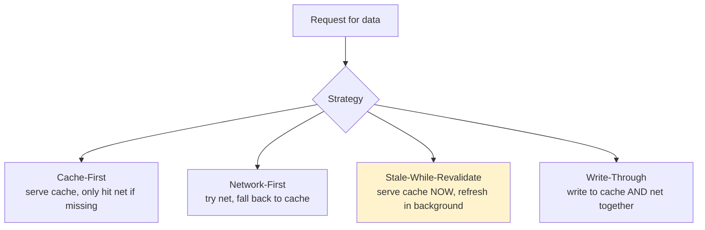
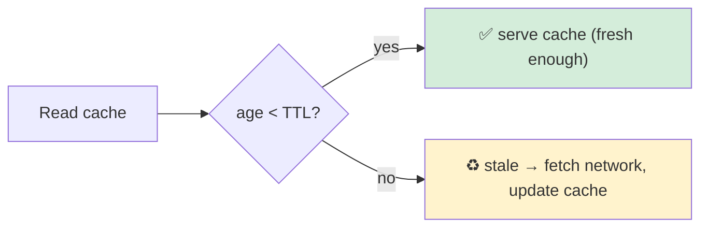
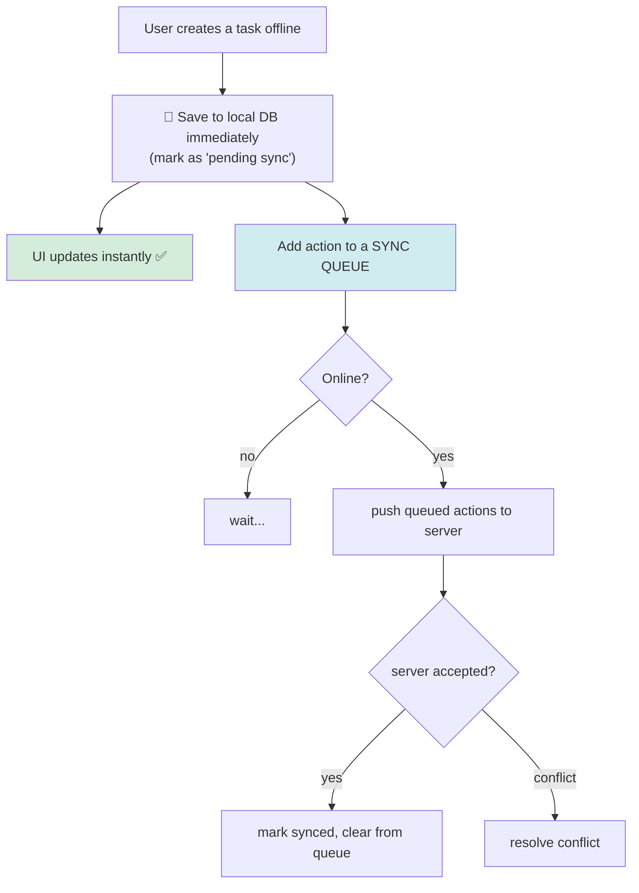
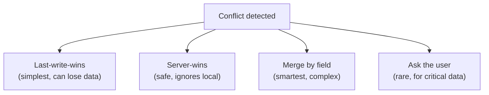
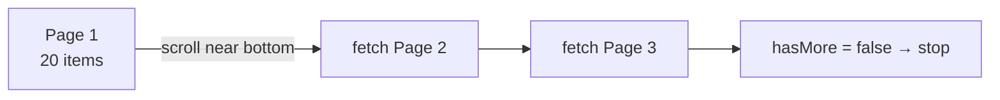
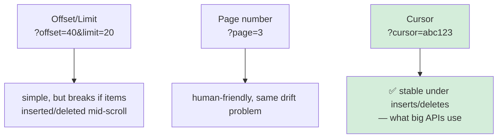
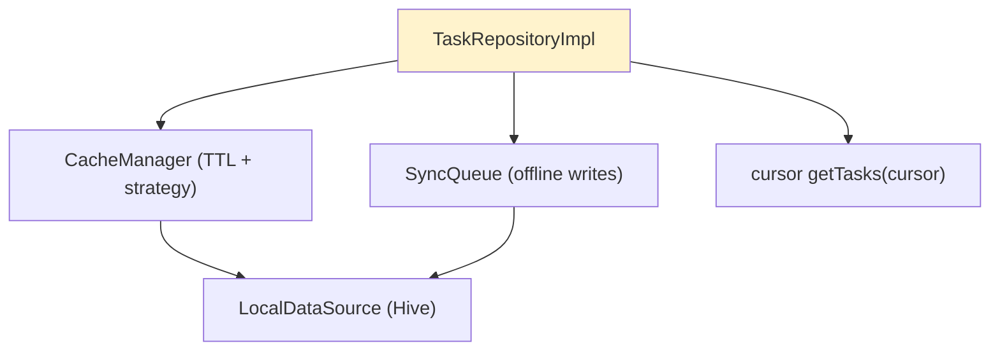
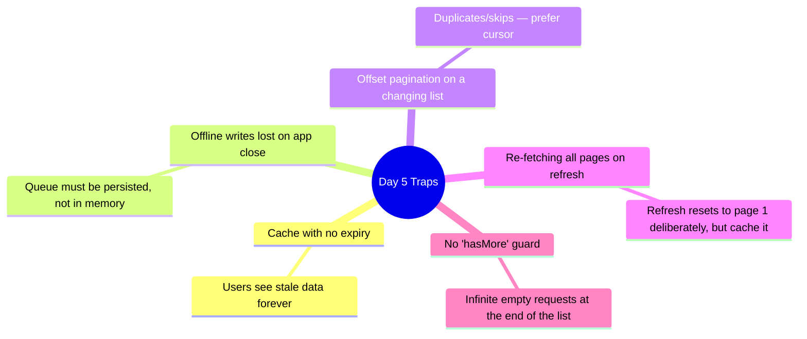

# 📖 Day 5 — Caching, Offline-First & Pagination
### *The chapter where your app gets fast, works on the subway, and never loads 10,000 rows at once*

---

## 1. The Story 🚇

A user opens TaskFlow on the Cairo metro. No signal. **Hana's** version shows a spinner forever, then "Error." The user closes the app in frustration. Then the train surfaces, signal returns — and her app re-downloads *everything*, freezing for 4 seconds while it parses 5,000 tasks at once.

A great app behaves like a **good notebook**: it shows you what you wrote last time *instantly* (cache), works in the tunnel (offline-first), quietly syncs when signal returns, and loads tasks a **page at a time** so it's never slow. Today you turn the librarian from Day 4 into a *smart* one.

Three powers today: **Caching** (speed), **Offline-first** (resilience), **Pagination** (scale).

---

## 2. Caching: The Big Picture 🗺️

Caching answers one question: *when someone asks for data, do I serve the cache, the network, or both?* There are named strategies:

| Strategy | Feels like | Best for |
|---|---|---|
| Cache-first | instant, maybe stale | rarely-changing data (config, profile) |
| Network-first | fresh, slower | data that must be current (balance) |
| **Stale-while-revalidate** | instant *and* eventually fresh | feeds, lists (TaskFlow's tasks) |
| Write-through | consistent writes | creating/updating records |

> **Mental model 🥪:** Stale-while-revalidate is serving yesterday's sandwich *immediately* while making a fresh one in the kitchen. The user eats now and gets the fresh one a second later. Best of both.

### Cache needs an expiry (TTL)

---

## 3. Offline-First 🛜

Offline-first flips the default: the app assumes it **might** be offline and treats the local DB as primary, syncing with the server as a background concern.

> **Critical idea 💡:** Offline-first means **the UI never waits for the network to feel responsive.** Writes go to local storage and a queue first; the network catches up later. This is *eventual consistency*.

### Conflict resolution (the hard part)
What if the same task was edited offline by you and online by a teammate?

---

## 4. Pagination 📜

Never load 10,000 tasks at once. Load a **page**, then more as the user scrolls.

Three pagination styles — know the trade-offs:

> **Mental model 🔖:** A cursor is a *bookmark*. "Give me the 20 tasks after this bookmark." Even if rows are added or removed elsewhere, the bookmark still points to the right spot — unlike "give me rows 40–60," which shifts when the list changes.

---

## 5. How This Maps to TaskFlow 🧩

Today: add a `CacheManager` with TTL, implement **stale-while-revalidate** for the task list, add a **sync queue** stub for offline writes, and make `getTasks(cursor)` append pages.

---

## 6. Common Traps ⚠️

---

## 7. 🏢 Interview Vault — Questions From Top Middle East Companies
> *This is gold at Careem, Talabat, Swvl, Mrsool — region-wide patchy networks make offline-first a real requirement, not theory.*

**Q1. Compare cache-first vs network-first vs stale-while-revalidate.**
> **A:** Cache-first serves the cache and only hits the network on a miss (fast, may be stale). Network-first prioritizes fresh data with cache as fallback (current, slower). Stale-while-revalidate serves the cache instantly *and* refreshes in the background (fast *and* eventually fresh) — ideal for lists/feeds.
> *🎯 Really testing:* picking the right strategy per data type.

**Q2. How do you design an offline-first feature?**
> **A:** Treat local storage as primary: writes go to the local DB immediately and into a *persisted* sync queue; the UI updates optimistically. A sync process flushes the queue to the server when connectivity returns, handling conflicts. The user never waits on the network — eventual consistency.
> *🎯 Really testing:* whole-system offline thinking + persistence of the queue.

**Q3. How do you resolve sync conflicts?**
> **A:** Strategies range from last-write-wins (simple, can lose data), server-wins (safe), field-level merge (smart, complex), to prompting the user for critical data. Choice depends on the data's importance and the business rules.
> *🎯 Really testing:* awareness that there's no one answer — trade-offs.

**Q4. Offset vs cursor pagination — which and why?**
> **A:** Offset (`limit/offset`) is simple but unstable: inserts/deletes during scrolling cause skipped or duplicated rows. Cursor pagination uses an opaque pointer to the last item, staying stable under concurrent changes — preferred for large, frequently-changing datasets.
> *🎯 Really testing:* you understand *why* big APIs use cursors.

**Q5. How do you implement infinite scroll without jank?**
> **A:** Detect scroll near the bottom, guard with `isLoadingMore` and `hasMore` flags to avoid duplicate/empty requests, append the new page to existing state (don't rebuild the whole list), and cache pages. Keep parsing off the UI thread for large pages.
> *🎯 Really testing:* practical performance + state management.

---

## 8. What You Must Be Able To Do By Tonight ✅
- [ ] Explain all four cache strategies + when to use each.
- [ ] Design offline-first writes with a persisted sync queue.
- [ ] Explain cursor vs offset pagination with the bookmark analogy.
- [ ] Implement stale-while-revalidate + cursor paging in TaskFlow.
- [ ] Answer interview Q1–Q5. **Checkpoint:** review Days 1–5 docs.

## 9. The One Sentence To Remember 🧠
> **"Serve the cache instantly and refresh in the background, treat local storage as primary with a sync queue for offline writes, and page data with cursors so the app stays fast, resilient, and scalable."**

➡️ **Next chapter (Day 6):** we build a bulletproof **error-handling system** and a real **authentication** data layer.
