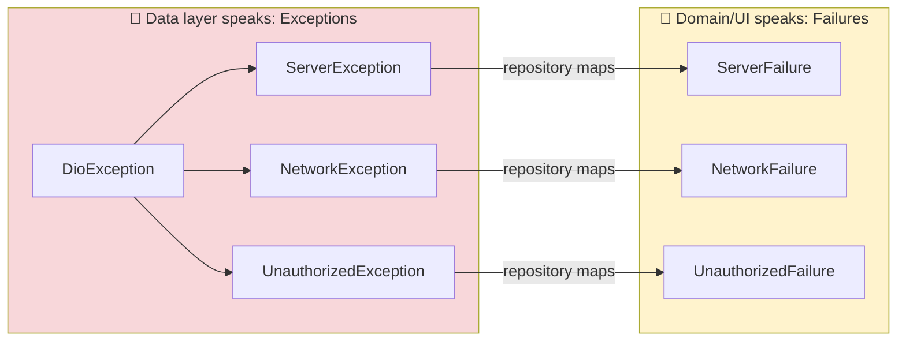
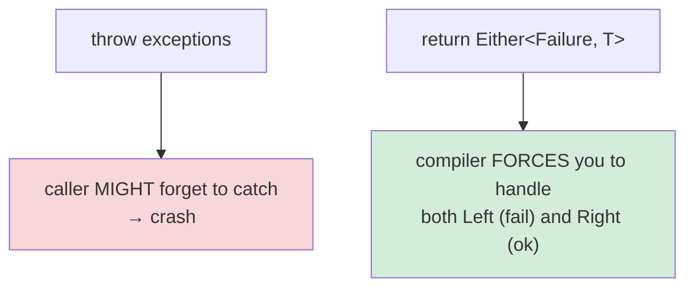
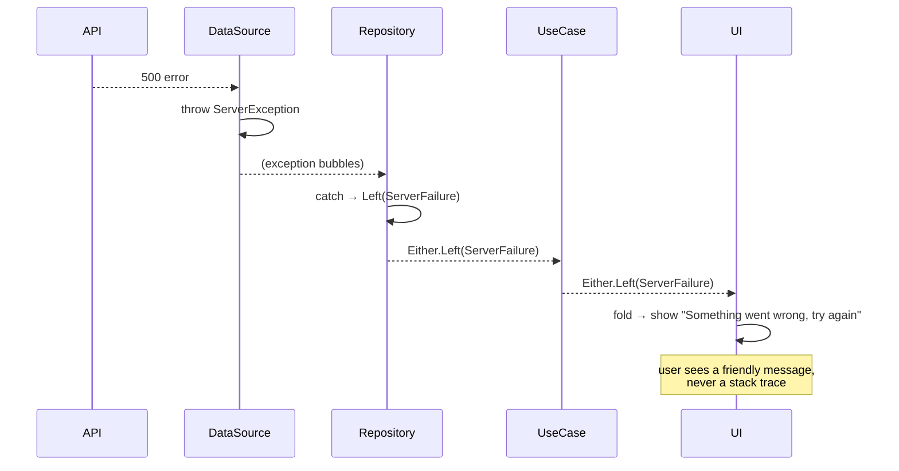
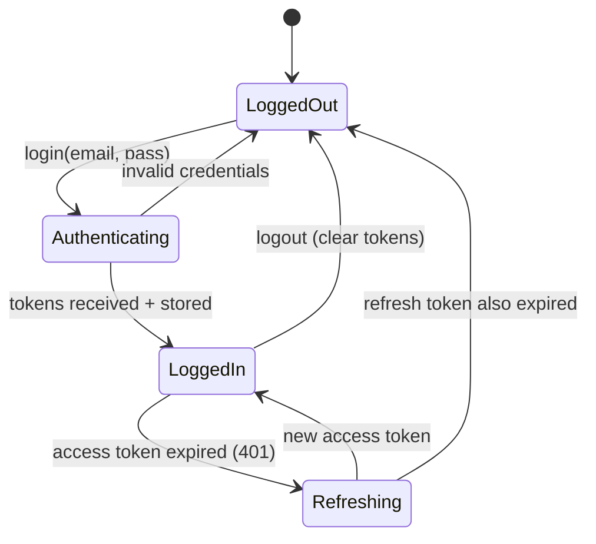
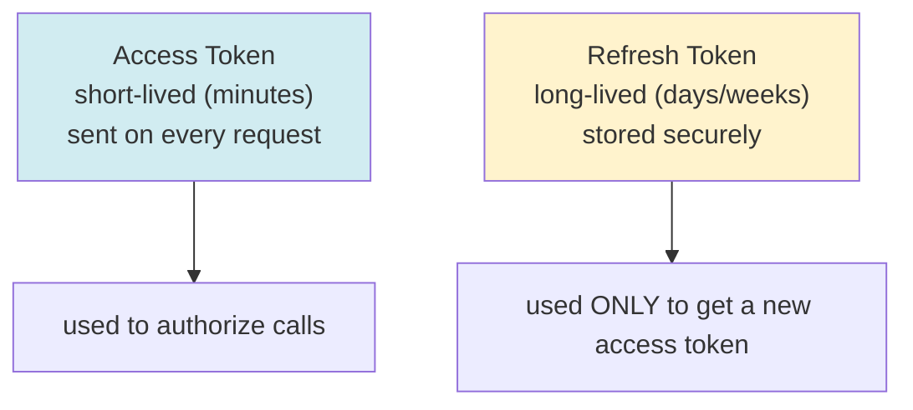
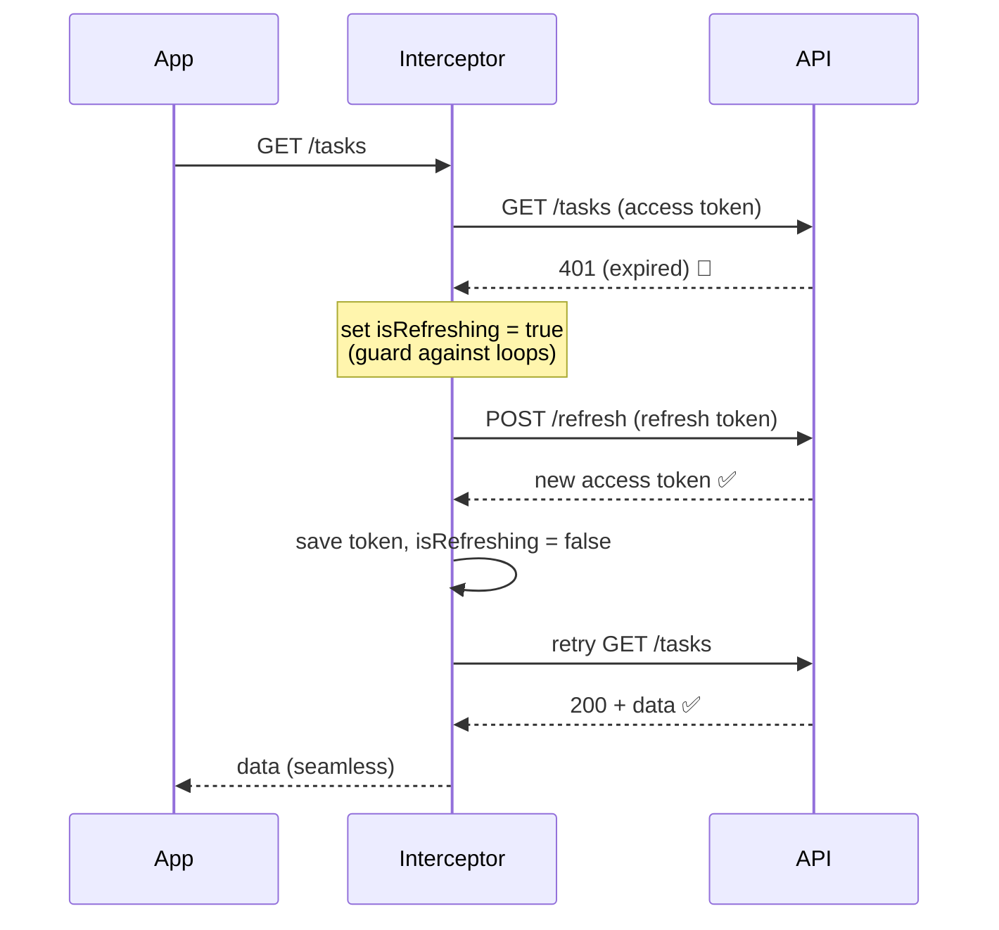
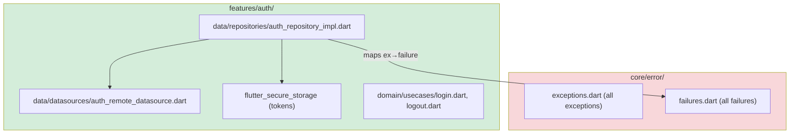
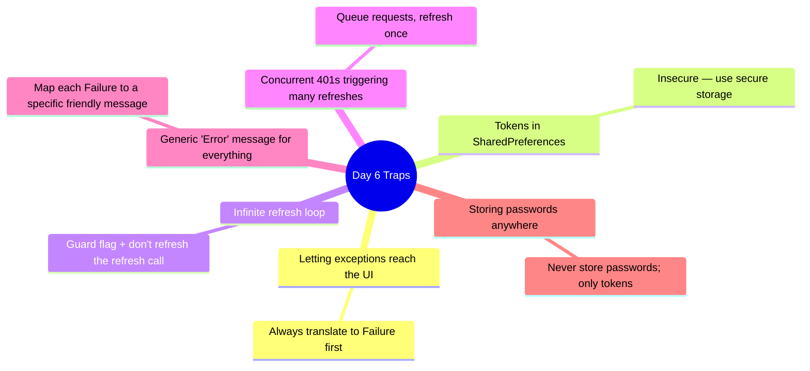

# 📖 Day 6 — Error Handling & Authentication
### *The chapter where failures become polite messages, and your app learns who you are*

---

## 1. The Story 💥🔐

Two stories today, because they're deeply linked.

**Story 1 — the crash.** A user taps "refresh" in a tunnel. **Tarek's** app throws a raw `DioException` all the way up to the widget. The screen shows a red error overlay with a stack trace. The user thinks the app is broken. It wasn't broken — it just had no internet. Tarek never *translated* the failure into something human.

**Story 2 — the locked door.** TaskFlow needs to know *who* you are before showing your tasks. That means login, storing a token safely, attaching it to every request, and — the tricky part — silently refreshing it when it expires so the user isn't kicked out mid-session.

Today you build two systems that every serious app needs: a **failure pipeline** (so errors are always graceful) and an **auth data layer** (so identity is handled securely).

---

## 2. Error Handling: The Two-Type System 🎯

Remember Day 1: raw exceptions must **never** reach the UI. So we use **two** error types, and translate between them at the repository boundary.

> **Mental model 🛂:** Exceptions are the *local dialect* of the data layer — thrown, unpredictable, low-level. Failures are the *official language* of the domain — returned as values, typed, safe. The repository is the **translator** at the border. The UI only ever hears the official language.

### Why `Either<Failure, T>` instead of try/catch everywhere?

`Either` makes the failure a **value you must handle**, not a surprise you might miss. `Left` = failure, `Right` = success ("right" = "correct").

---

## 3. The Full Error Journey 🚀

---

## 4. Authentication: The Big Picture 🔐

Auth is a lifecycle: get a token, use it, refresh it, throw it away.

### Token types — know the difference

> **Critical idea 💡:** Two tokens exist for *security*. The access token is exposed on every request, so it's short-lived (a stolen one expires fast). The refresh token is precious and rarely transmitted, so it's long-lived. Store **both** in `flutter_secure_storage`, never SharedPreferences.

### The silent refresh (the senior-level detail)

---

## 5. How This Maps to TaskFlow 🧩

Today: expand `core/error/` to full exception+failure sets, build the auth feature (login/register/refresh), store tokens securely, wire the auth interceptor to do the silent refresh, and add `User` entity + `Login`/`Logout` use cases.

---

## 6. Common Traps ⚠️

---

## 7. 🏢 Interview Vault — Questions From Top Middle East Companies
> *Fintech (Tabby, Tamara, Halan) and any app with accounts grill you on this — security + UX of auth is make-or-break.*

**Q1. Why two error types (Exception and Failure)?**
> **A:** Exceptions are low-level, thrown, and live in the data layer; Failures are typed values returned to the domain/UI. The repository translates exception→failure at the boundary, so raw library errors never leak inward and the UI always handles a clean, expected type.
> *🎯 Really testing:* boundary discipline + the "errors as values" idea.

**Q2. Why `Either<Failure, T>` over throwing?**
> **A:** It makes error handling explicit and compiler-enforced — the caller must handle both `Left` and `Right`. Throwing relies on the caller remembering to catch, which is easy to forget and causes crashes.
> *🎯 Really testing:* functional error-handling maturity.

**Q3. Explain access vs refresh tokens and where you store them.**
> **A:** Access tokens are short-lived and sent on every request; refresh tokens are long-lived and used only to mint new access tokens. Both go in secure storage (Keychain/Keystore). Short access-token lifetime limits damage if intercepted.
> *🎯 Really testing:* security fundamentals.

**Q4. How do you implement silent token refresh, and what can go wrong?**
> **A:** An interceptor catches 401, calls refresh, stores the new token, and retries the original request. Pitfalls: an infinite loop if the refresh call itself 401s (guard with a flag and don't refresh the refresh endpoint), and a refresh storm when many requests 401 at once (queue them and refresh a single time).
> *🎯 Really testing:* the loop guard + concurrency — the senior differentiators.

**Q5. The user's refresh token expires. What's the correct UX?**
> **A:** Treat it as a hard logout: clear stored tokens, reset auth state, and redirect to login — ideally preserving where they were so they return after re-auth. Never show a raw error.
> *🎯 Really testing:* graceful session-expiry handling.

---

## 8. What You Must Be Able To Do By Tonight ✅
- [ ] Explain the exception→failure translation and where it happens.
- [ ] Justify `Either` over throwing.
- [ ] Explain access vs refresh tokens + secure storage.
- [ ] Implement login + silent refresh with a loop guard.
- [ ] Answer interview Q1–Q5 from memory.

## 9. The One Sentence To Remember 🧠
> **"Translate every exception into a typed Failure at the repository boundary so the UI never crashes, and manage identity with short-lived access tokens, securely-stored refresh tokens, and a guarded silent-refresh flow."**

➡️ **Next chapter (Day 7):** we complete the **Domain layer** — pure entities, use cases, and where business rules truly belong.
