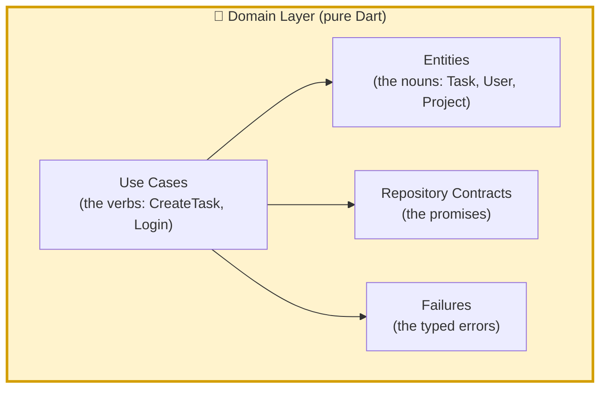
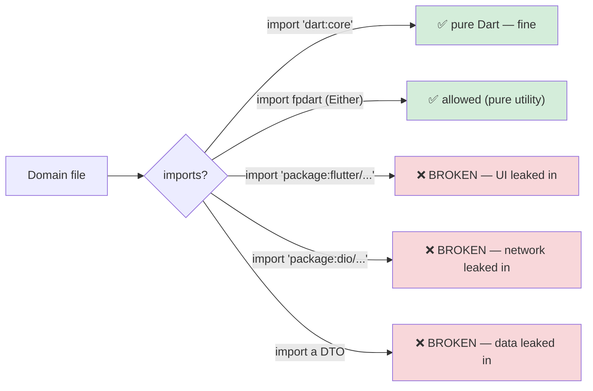
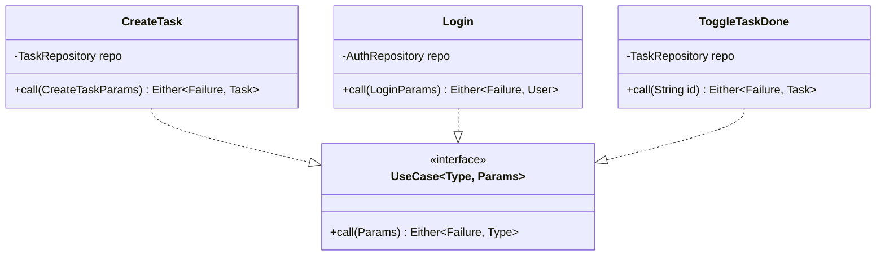
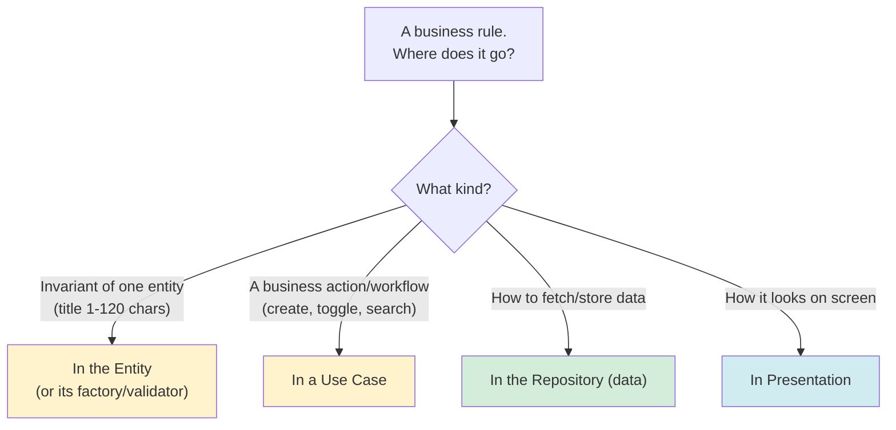
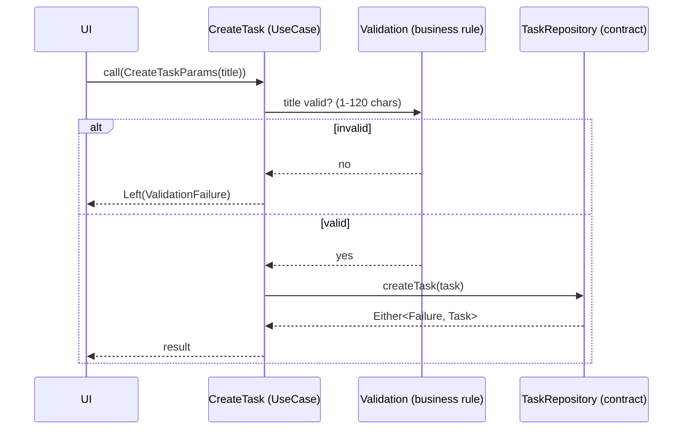
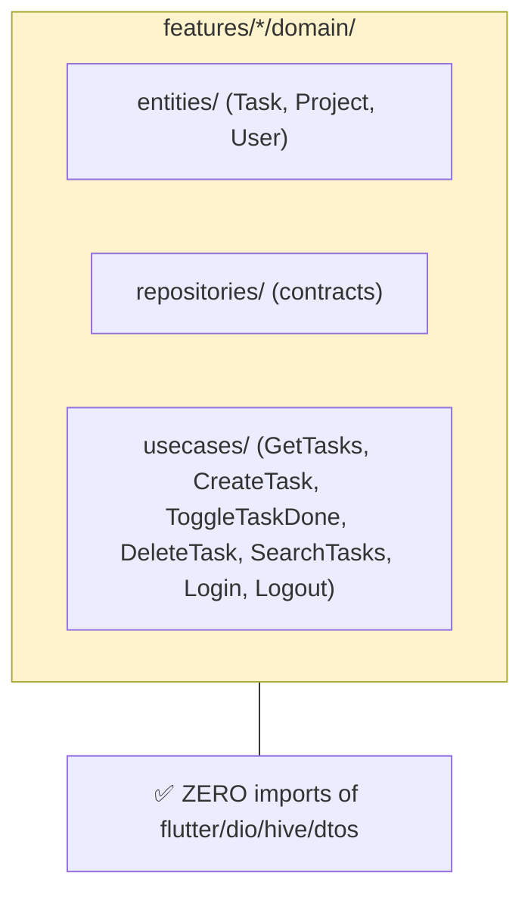
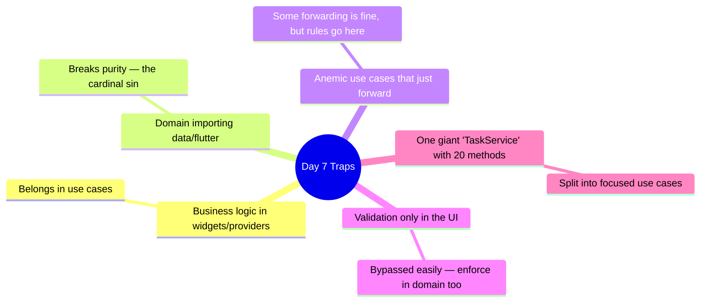

# 📖 Day 7 — The Domain Layer: Entities, Use Cases & Business Rules
### *The chapter where you find the soul of the app*

---

## 1. The Story 🧠

Strip away the buttons, the API, the database. What is TaskFlow, really? It's a set of *truths*: "a task has a title and can be done or not", "you can't create a task with an empty title", "completing a task toggles its status." These truths don't care if the UI is Flutter or a website, or if the data comes from REST or GraphQL. **They are the soul of the app.**

**Mariam** scattered these truths everywhere — title validation in the widget, the "toggle" logic in the repository, the "what counts as overdue" rule in three different screens. When the business changed the rule ("titles max 120 chars"), she found four copies, fixed three, missed one. The app became inconsistent.

The **Domain layer** is the single home for these truths. Pure Dart, no dependencies, the part of your app that would survive even if Flutter disappeared tomorrow. Today you complete it.

---

## 2. The Big Picture 🗺️

The domain has exactly three citizens — and today you've already met them, but now you make them complete:



> **Mental model 📜:** Think of the domain as the **rulebook of a board game**. Entities are the pieces, use cases are the legal moves, contracts are "someone will provide the dice and board." The rulebook never mentions whether you play on wood or an app — that's the implementation's problem.

---

## 3. The Critical Idea: Purity 🎯

The domain's superpower is that it imports **nothing** from the outside world.



**The litmus test:** open any file in `domain/`. If you see `import 'package:flutter'` or `dio` or a `Dto`, the layering is broken. A pure domain can be unit-tested in milliseconds with zero mocks of frameworks.

---

## 4. The Use Case Pattern 🎬

A **use case** (a.k.a. interactor) represents **one single business action**. One class, one job, one `call()` method.



Why one class per action instead of fat methods on a service?

```mermaid
mindmap
  root((Why one use case<br/>per action))
    Single Responsibility
      each class does exactly one thing
    Readable intent
      CreateTask() screams what it does
    Easy to test
      tiny, focused unit tests
    Composable
      a use case can call other use cases
    Clear dependency
      depends only on the repo it needs
```

> **Critical idea 💡:** Use cases are the **only doorway** the presentation layer uses to enter the domain. The UI never touches a repository directly — it always goes through a use case. This keeps business logic out of the UI.

---

## 5. Where Do Business Rules Live? 🧩

This is the question that confuses everyone. The answer:



Example with TaskFlow:
- *"A task title must be 1–120 chars"* → entity invariant / validated in `CreateTask` use case → returns `ValidationFailure`.
- *"Toggling done flips the boolean and persists"* → `ToggleTaskDone` use case.
- *"Fetch from network, fall back to cache"* → repository (data). **Not** a business rule — it's a data policy.

---

## 6. The Full Domain in Motion 🚀



---

## 7. How This Maps to TaskFlow 🧩



Today: finalize all entities with invariants, implement the remaining use cases, enforce at least one real validation rule (title length → `ValidationFailure`), and **prove purity** by listing the imports in your domain folder.

---

## 8. Common Traps ⚠️



---

## 9. 🏢 Interview Vault — Questions From Top Middle East Companies
> *Senior screens at Noon, Careem, Foodics dig hard here — it reveals whether you truly understand layering or just copy templates.*

**Q1. What is a use case and why one class per action?**
> **A:** A use case encapsulates a single business action with one `call()` method. One-per-action enforces the Single Responsibility Principle, makes intent explicit, keeps tests tiny, and lets use cases compose. It's the single entry point from presentation into the domain.
> *🎯 Really testing:* SRP applied + understanding the domain entry point.

**Q2. Where do business rules belong — and give an example of getting it wrong.**
> **A:** Entity invariants live on the entity; business actions/validation live in use cases; data policies (caching) live in the repository. Getting it wrong: putting title validation only in the widget — it's bypassed by any other caller and duplicated across screens. Put it in the use case (and/or entity) so it's enforced once.
> *🎯 Really testing:* precise placement of logic.

**Q3. Why must the domain be pure Dart?**
> **A:** So business logic is independent of frameworks — testable in milliseconds without mocks of Flutter or the network, portable, and immune to UI/data changes. If the domain imports Flutter or Dio, that independence is gone.
> *🎯 Really testing:* the *why* behind purity, not just the rule.

**Q4. Does the UI ever call the repository directly?**
> **A:** No. The UI calls use cases; use cases call repositories. This keeps business logic out of the UI and preserves a single entry point into the domain. (Some teams allow trivial reads to skip a use case, but the default is to go through one.)
> *🎯 Really testing:* discipline + awareness of pragmatic exceptions.

**Q5. Entity vs Model vs DTO — distinguish them.**
> **A:** A DTO mirrors the API JSON (data layer). An entity is the pure business object (domain layer). "Model" is an ambiguous term often meaning either; in Clean Architecture we keep DTO (data) and Entity (domain) strictly separate, bridged by a mapper.
> *🎯 Really testing:* vocabulary precision — a frequent junior stumble.

---

## 10. What You Must Be Able To Do By Tonight ✅
- [ ] Explain the use case pattern + why one-per-action.
- [ ] Correctly place 4 different rules across the layers.
- [ ] Prove your domain folder imports nothing from flutter/dio/data.
- [ ] Implement all the TaskFlow use cases + one validation rule.
- [ ] Answer interview Q1–Q5 from memory.

## 11. The One Sentence To Remember 🧠
> **"The domain is the pure-Dart soul of the app — entities are the nouns, use cases are the verbs, and all business rules live here, untouched by any framework, network, or UI."**

➡️ **Next chapter (Day 8):** the data and domain are ready — now we bring the app to life with **Riverpod**, your state-management focus. The four-day deep dive begins.
